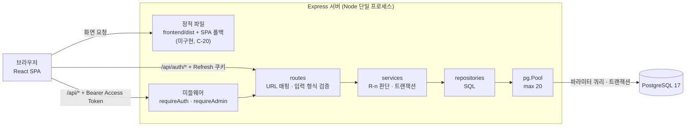
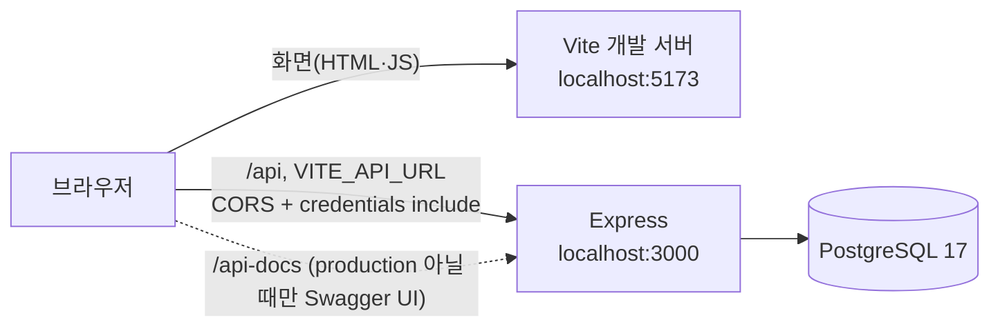
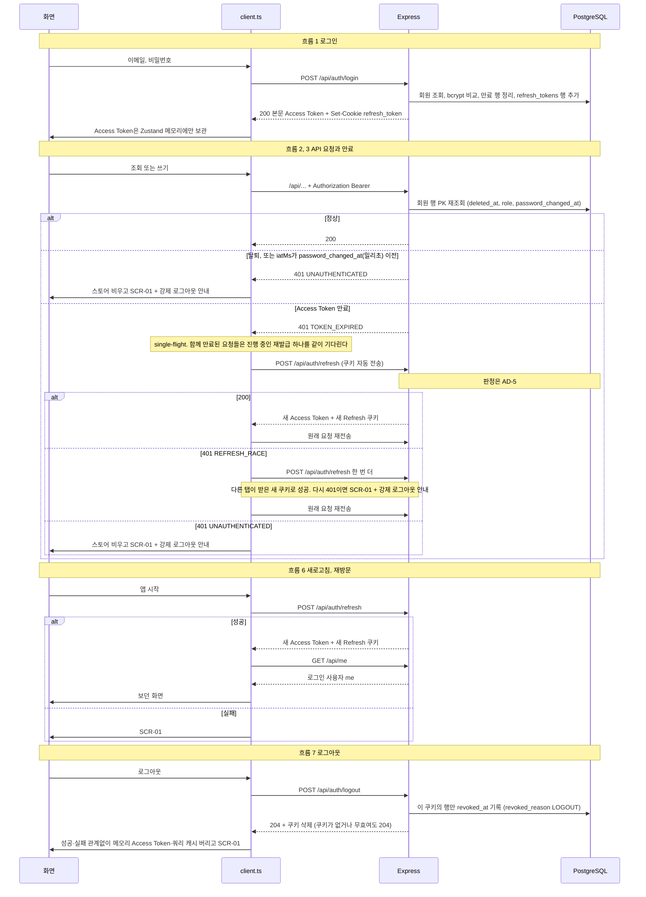
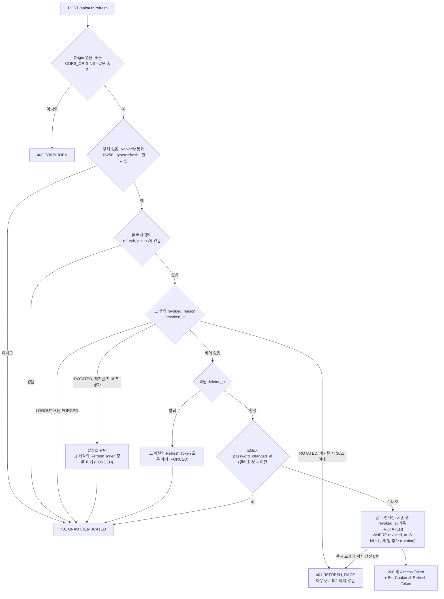
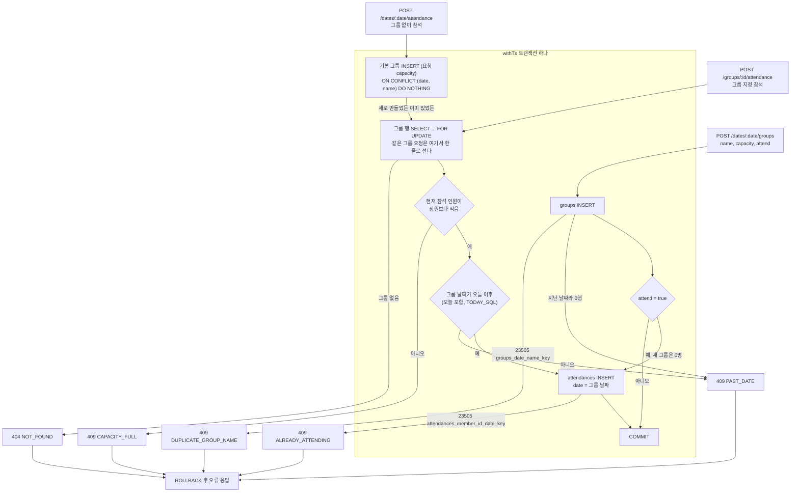
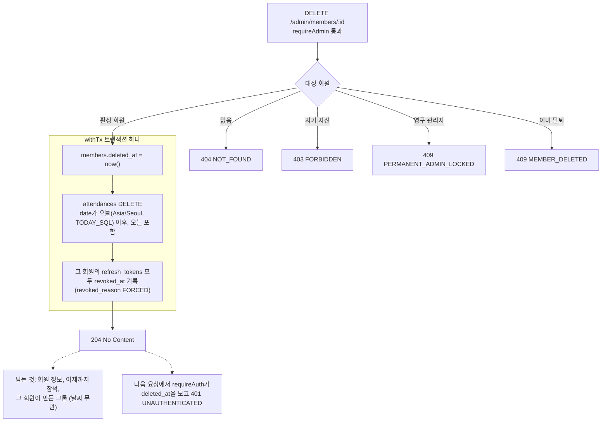
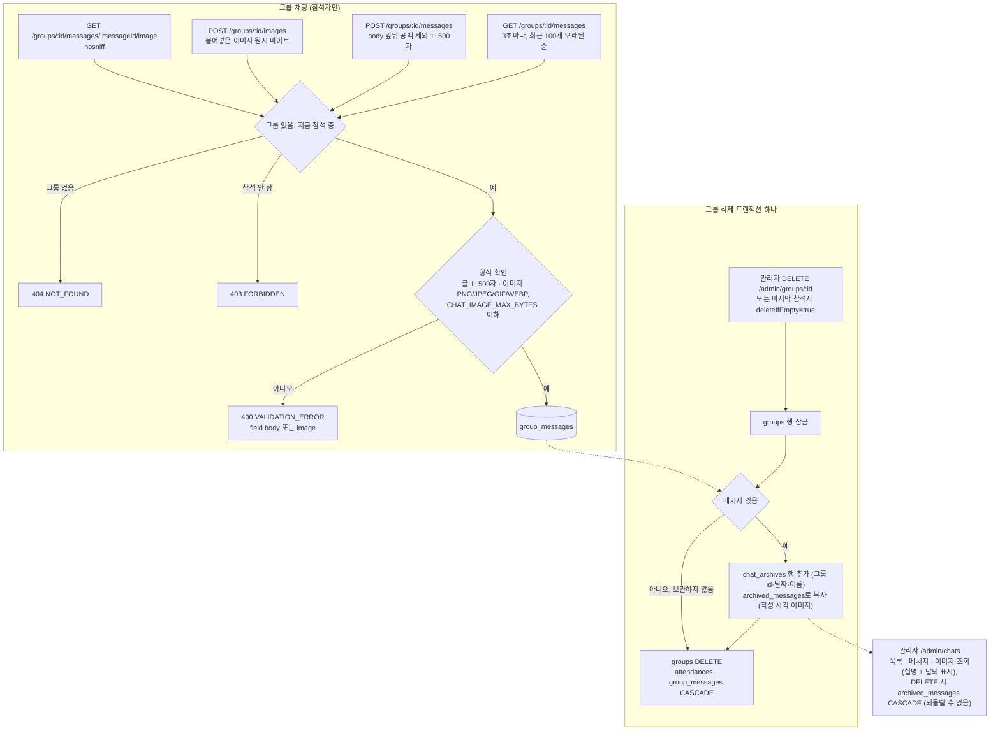

# cal-todo 기술 아키텍처 다이어그램

> 근거: [1-definition.md](1-definition.md) **v0.15**, [2-user-scenarios.md](2-user-scenarios.md) **v0.18**, [2-PRD.md](2-PRD.md) **v0.14**, [3-screen-design.md](3-screen-design.md) **v0.17**, [4-wireframes.md](4-wireframes.md) **v0.8**, [5-project-principle.md](5-project-principle.md) **v0.11**. `R-n`·`UC-n`은 정의서, `S-n`은 시나리오, `M-n`·`FR-n`·`NFR-n`·`D-n`과 "6.1 흐름 n"은 PRD, `SCR-n`은 화면 설계서, `WF-n`은 와이어프레임, `L-n`·`C-n`·`T-n`·`ST-n`은 프로젝트 원칙 번호다. 이 문서가 정의하는 ID는 `AD-n`(다이어그램)이다. 다이어그램은 다른 문서의 내용을 그림으로 옮길 뿐이며 규칙을 새로 정하지 않는다. 문서와 그림이 다르면 문서가 맞다.

## 변경 이력

> 문서를 바꿀 때마다 표 맨 아래에 한 줄을 추가한다. 버전은 내용 추가·변경 시 소수점 자리(0.1 → 0.2), 구조가 크게 바뀌면 정수 자리(→ 1.0)를 올린다.

| 버전 | 날짜 | 변경자 | 변경내용 |
|------|------|--------|----------|
| 0.1 | 2026-09-30 | uokevin | 초안 작성 |
| 0.2 | 2026-09-30 | uokevin | 문서 반영에 맞춰 수정: AD-4 두 번째 `REFRESH_RACE`는 SCR-01, AD-7에 자기 삭제 403과 성공 204, 확인 필요 항목 해소, 머리말 기준 버전 갱신 |
| 0.3 | 2026-09-30 | uokevin | AD-3(데이터 모델 ERD)을 7-erd.md로 분리하고 AD-3은 폐기 표시 |
| 0.4 | 2026-09-30 | uokevin | 정합성 점검 반영: AD-6에 `기본` 그룹이 없는데 `capacity`가 없으면 400 `VALIDATION_ERROR`(PRD v0.6 9장) 추가, 머리말 기준 버전 갱신 |
| 0.5 | 2026-09-30 | uokevin | 계획 빈틈 결정 반영(PRD v0.8 6.1 흐름 5): AD-5 판정을 `revoked_reason`으로 나눠 30초 유예는 `ROTATED`에만, `LOGOUT`·`FORCED`는 즉시 401 `UNAUTHENTICATED`, AD-4 로그아웃·AD-7 회원 삭제에 폐기 사유 표시, 머리말 기준 버전 갱신 |
| 0.6 | 2026-09-30 | uokevin | 머리말 기준 버전 갱신 |
| 0.7 | 2026-09-30 | uokevin | 정합성 점검 반영: 머리말 기준 버전 갱신 |
| 0.8 | 2026-09-30 | uokevin | 머리말 기준 버전 갱신 |
| 0.9 | 2026-10-01 | uokevin | 백엔드 구현 반영: AD-2를 CORS 허용 목록(`CORS_ORIGINS`, 기본 비어 있음)과 개발용 Swagger UI(`/api-docs`)에 맞춤, 머리말 기준 버전 갱신 |
| 0.10 | 2026-10-02 | uokevin | 코드 기준 최신화: AD-1 SPA 정적 서빙 미구현 표시, AD-2 Vite 프록시 없이 브라우저가 `VITE_API_URL`로 Express를 직접 호출(CORS), AD-4 `iatMs`·복원은 재발급 후 `GET /me`·강제 로그아웃 안내, AD-5 `iatMs`·출처 403·동시 교체에 진 요청 `REFRESH_RACE`, AD-6 `PAST_DATE` 분기와 그룹 삭제(잠금 → 채팅 보관 → DELETE)·`deleteIfEmpty`, AD-8 그룹 채팅·채팅 보관 흐름 추가, 머리말 기준 버전 갱신 |

## 번호 정책

- `AD-n`은 한 번 붙이면 바꾸거나 다시 쓰지 않는다. 새 다이어그램은 마지막 번호 다음을 쓰고, 없어진 것은 `(폐기, vX.Y)`로 남긴다.

## 다이어그램 목록

| ID | 이름 | 종류 | 언제 보면 되는지 |
|----|------|------|------------------|
| AD-1 | 시스템 구성 | flowchart | 처음 코드를 볼 때. 요청이 어디를 거쳐 DB까지 가는지 |
| AD-2 | 개발 환경 | flowchart | 로컬에서 프론트·백엔드를 띄울 때 |
| AD-3 | (폐기, v0.3) 데이터 모델 → [7-erd.md](7-erd.md) | - | - |
| AD-4 | 인증 토큰 흐름 | sequenceDiagram | `lib/client.ts`, `requireAuth`, `/auth/*`를 만들 때, S-14·S-15 확인 시 |
| AD-5 | 토큰 재발급 판정 | flowchart | `services/auth.js`의 재발급과 T-5 인증 테스트를 쓸 때 |
| AD-6 | 참석 등록 트랜잭션 | flowchart | 참석·그룹 생성 service와 T-5 동시성 테스트를 쓸 때 |
| AD-7 | 회원 삭제 트랜잭션 | flowchart | `DELETE /admin/members/:id`를 만들 때 |
| AD-8 | 그룹 채팅·채팅 보관 흐름 | flowchart | 채팅 API·`GroupChat.tsx`, 그룹 삭제 시 보관을 볼 때 |

---

## AD-1. 시스템 구성

서버 1대에 Express와 PostgreSQL을 두고, Express가 SPA 정적 파일과 `/api`를 함께 서빙하는 것이 목표다. 정적 파일 서빙(C-20)은 아직 구현되지 않아 지금은 프론트를 따로 띄우고 브라우저가 `/api`를 직접 부른다(AD-2). 백엔드 레이어는 한 방향으로만 의존한다. 근거: PRD 6장, D-5, NFR-1, L-1 ~ L-6, C-17, C-20.

- `/api/auth/*`(가입·로그인·재발급·로그아웃)는 공개 경로라 인증 미들웨어를 거치지 않는다(PRD 9장).

## AD-2. 개발 환경

Vite 프록시는 쓰지 않는다. 브라우저는 Vite 개발 서버(`localhost:5173`)에서 화면만 받고, `/api`는 `VITE_API_URL`(`http://localhost:3000/api`, `frontend/.env.development`)로 Express를 직접 부른다(`credentials: 'include'`). 다른 출처이므로 백엔드 `CORS_ORIGINS`에 `http://localhost:5173`을 넣어야 한다(비우면 CORS 헤더 없음). `/auth/refresh`·`/auth/logout`은 `Origin`이 없거나 허용 목록·같은 출처일 때만 받는다(C-7). 배포도 같은 방식(프론트·백엔드 분리 + CORS)이며, Express의 SPA 정적 서빙은 아직 없다(C-20). `NODE_ENV`가 `production`이 아니면 Express가 `/api-docs`에 Swagger UI도 띄운다. 근거: NFR-14, C-18, PRD 9장.

## AD-3. 데이터 모델 (폐기, v0.3)

[7-erd.md](7-erd.md)로 옮겼다.

## AD-4. 인증 토큰 흐름

로그인, API 요청, Access Token 만료 시 single-flight 재발급, 앱 시작 시 복원, 로그아웃을 한 장에 보인다. 토큰 페이로드에는 밀리초 발급 시각 `iatMs`가 들어간다. 서버의 재발급 판정은 AD-5. 근거: 6.1 흐름 1 ~ 3·6·7, D-1, D-4, NFR-8, L-11, C-7.

- 복원 중에는 화면 가운데 앱 이름만 보인다(WF 2.4). 로그인 가드는 `GET /me`를 30초마다·창으로 돌아올 때 다시 읽는다.
- 강제 로그아웃(위 `UNAUTHENTICATED`)이면 SCR-01에 노란 안내 "다시 로그인해 주세요"를 띄운다(스토어 `isForcedOut`, WF-01).

## AD-5. 토큰 재발급 판정

`POST /auth/refresh`에서 서버가 판단하는 순서. 재사용 감지의 30초 유예와 강제 폐기가 여기서 갈린다. 폐기 사유(`revoked_reason`)는 `ROTATED`(교체), `LOGOUT`(로그아웃), `FORCED`(강제 폐기)이고, 30초 유예는 `ROTATED`에만 적용한다. 근거: 6.1 흐름 4·5·7·8, PRD 7장, D-4, NFR-9, C-7, T-5 인증.

- 강제 폐기(흐름 8)는 이 판정의 입력을 바꾸는 쪽이다. 비밀번호 변경은 `password_changed_at`을 갱신해 Q5에서, 관리자 비밀번호 변경·회원 삭제는 행을 모두 `FORCED`로 폐기해 Q3에서 30초 유예 없이 바로 `UNAUTHENTICATED`가 된다. 역할 변경은 아무것도 폐기하지 않는다.
- `iatMs`가 없는 옛 토큰은 `iat * 1000`으로 비교한다. 출처 확인(Q0)은 `/auth/logout`에도 같다.

## AD-6. 참석 등록 트랜잭션

참석 등록 세 가지 경로가 한 트랜잭션 안에서 정원·중복·기본 그룹을 어떻게 지키는지 보인다. 409는 모두 ROLLBACK이므로 이 요청에서 만든 그룹(기본 그룹 포함)도 남지 않는다. 근거: R-2, R-3, R-4, R-6, R-13, R-16, NFR-3 ~ NFR-5, D-2, D-3, PRD 9장, L-5, C-8, T-5 동시성·원자성.

- 그룹 없이 참석(E2)에서 `기본` 그룹이 없는데 요청에 `capacity`가 없으면 400 `VALIDATION_ERROR`(`field: capacity`)로 ROLLBACK한다(PRD 9장, SCR-04).
- 정원 변경(`PATCH /admin/groups/:id`)도 같은 그룹 행 `FOR UPDATE` 뒤 인원과 비교한다(409 `CAPACITY_BELOW_COUNT`, R-3).
- 지난 날짜 확인은 INSERT의 조건(`WHERE date >= TODAY_SQL`)으로 한다. 참석(E1·E2)은 `attendances` INSERT가, 그룹 생성(E3)은 `groups` INSERT가 0행이면 409 `PAST_DATE`이므로 그룹 생성은 `attend`와 관계없이 막힌다(R-6). E2의 기본 그룹 INSERT도 ROLLBACK되어 남지 않는다. 참석 취소·빈 그룹 삭제·관리자 편집·삭제·빼기에는 날짜 제한이 없다.
- 그룹 삭제(R-13)는 한 트랜잭션에서 그룹 행 잠금 → 채팅 보관(R-15) → `groups` 행 DELETE 순서다. DELETE는 `ON DELETE CASCADE`로 참석·메시지까지 지운다(AD-8).
- 마지막 참석자 취소(`DELETE /groups/:id/attendance?deleteIfEmpty=true`, R-16)는 그룹 행 잠금 → 내 참석 삭제 → 남은 인원 0이고 내가 참석 중이었으면 위와 같은 보관 → 삭제, 200 `{groupDeleted}`.

## AD-7. 회원 삭제 트랜잭션

관리자의 회원 삭제는 비활성화이며, 세 테이블을 한 트랜잭션으로 바꾼다. 근거: R-9, R-11, R-12, FR-10, FR-16, NFR-5, 6.1 흐름 8, C-8, C-11.

## AD-8. 그룹 채팅·채팅 보관 흐름

그룹 채팅은 그 그룹에 지금 참석 중인 회원만 읽고 쓴다(관리자도 참석하지 않으면 403). 화면은 3초마다 목록을 다시 읽는다(캘린더도 3초). 그룹이 삭제되면 같은 트랜잭션에서 메시지를 채팅 보관함으로 옮기고, 보관함은 관리자만 본다. 근거: R-14, R-15, R-16, FR-20 ~ FR-22, C-9.

- 비관리자에게 채팅 작성자가 탈퇴 회원이면 `name: "탈퇴 회원"`, 관리자에게는 실명 + `isDeleted: true`다(C-10).
- 이미지 메시지의 `body`는 빈 문자열이고, 목록에는 이미지 바이트 없이 `hasImage`만 온다. 화면은 이미지를 Blob으로 받아 보여 준다.

---

## 확인 필요

그림을 그리며 문서에서 답을 찾지 못해 가정한 점이 생기면 여기에 적고, 결정되면 해당 문서에 반영한 뒤 이 목록에서 지운다.

- 현재 없음 (v0.1의 항목은 PRD v0.6, 정의서 v0.11, 원칙 v0.3에 반영됨)
