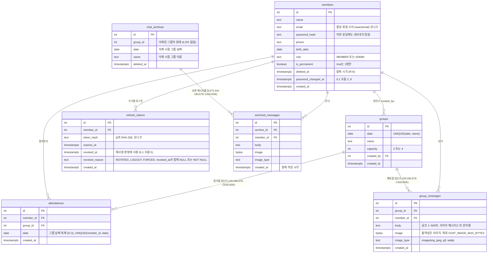

# cal-todo ERD

> 근거: [1-definition.md](1-definition.md) **v0.15**, [2-PRD.md](2-PRD.md) **v0.14**, [5-project-principle.md](5-project-principle.md) **v0.11**. `R-n`은 정의서, `D-n`과 "6.1 흐름 n"은 PRD, `C-n`은 프로젝트 원칙 번호다. 이 문서는 [6-arch-diagram.md](6-arch-diagram.md) v0.2의 AD-3(데이터 모델)을 옮긴 것이다. 테이블 정의의 기준은 PRD 7장이며, ERD와 문서가 다르면 문서가 맞다.

## 변경 이력

> 문서를 바꿀 때마다 표 맨 아래에 한 줄을 추가한다. 버전은 내용 추가·변경 시 소수점 자리(0.1 → 0.2), 구조가 크게 바뀌면 정수 자리(→ 1.0)를 올린다.

| 버전 | 날짜 | 변경자 | 변경내용 |
|------|------|--------|----------|
| 0.1 | 2026-09-30 | uokevin | 6-arch-diagram.md v0.2의 AD-3을 옮겨 작성 |
| 0.2 | 2026-09-30 | uokevin | 정합성 점검 반영: 머리말 기준 버전 갱신 |
| 0.3 | 2026-09-30 | uokevin | 계획 빈틈 결정 반영: `refresh_tokens.revoked_reason`(`ROTATED`·`LOGOUT`·`FORCED`, PRD v0.8 6.1 흐름 5·7장) 추가, 머리말 기준 버전 갱신 |
| 0.4 | 2026-09-30 | uokevin | 머리말 기준 버전 갱신 |
| 0.5 | 2026-09-30 | uokevin | 정합성 점검 반영: 머리말 기준 버전 갱신 |
| 0.6 | 2026-09-30 | uokevin | 머리말 기준 버전 갱신 |
| 0.7 | 2026-10-02 | uokevin | 채팅 테이블 3개(`group_messages`, `chat_archives`, `archived_messages`, 마이그레이션 002 ~ 004)와 관계 추가, 머리말 기준 버전 갱신 |

## 데이터 모델

테이블 7개(`schema_migrations` 제외)와 관계. 나이(R-12)와 그룹 상태(R-5)는 저장하지 않는다. 근거: PRD 7장, D-2, D-3, C-15. 마이그레이션 `001_init.sql` ~ `004_chat_images.sql`·repository SQL을 쓸 때 본다.

- 채팅 테이블은 `002_group_messages.sql`(그룹 채팅), `003_chat_archives.sql`(보관함), `004_chat_images.sql`(두 메시지 테이블에 이미지 컬럼)에서 만든다.
- `chat_archives.group_id`는 삭제된 그룹의 원래 id이며 FK가 아니다. 그룹이 삭제될 때 같은 트랜잭션에서 메시지를 보관함으로 복사한 뒤(R-15) 그룹을 지우면 `group_messages`는 CASCADE로 지워진다.

