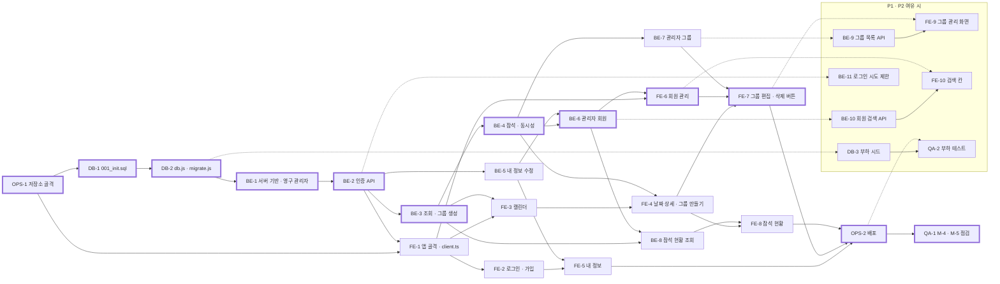

# cal-todo 작업 실행 계획

> 근거: [1-definition.md](1-definition.md) **v0.14**, [2-user-scenarios.md](2-user-scenarios.md) **v0.17**, [2-PRD.md](2-PRD.md) **v0.12**, [3-screen-design.md](3-screen-design.md) **v0.16**, [4-wireframes.md](4-wireframes.md) **v0.7**, [5-project-principle.md](5-project-principle.md) **v0.8**, [6-arch-diagram.md](6-arch-diagram.md) **v0.8**, [7-erd.md](7-erd.md) **v0.6**, [schema.sql](schema.sql). `REQ-n`·`R-n`·`UC-n`은 정의서, `S-n`은 시나리오, `M-n`·`FR-n`·`NFR-n`·`D-n`과 "6.1 흐름 n"은 PRD, `SCR-n`은 화면 설계서, `WF-n`은 와이어프레임, `P-n`·`L-n`·`N-n`·`T-n`·`C-n`·`ST-n`은 프로젝트 원칙, `AD-n`은 아키텍처 다이어그램 번호다. 이 문서가 정의하는 ID는 작업 단위 `OPS-n`(공통·셋업·배포), `DB-n`(데이터베이스), `BE-n`(백엔드), `FE-n`(프론트엔드), `QA-n`(통합·검증)이다. 규칙·API·화면은 다시 정의하지 않고 ID로 참조한다.

- **상태**: 초안
- **버전**: 0.7

## 변경 이력

> 문서를 바꿀 때마다 표 맨 아래에 한 줄을 추가한다. 버전은 내용 추가·변경 시 소수점 자리(0.1 → 0.2), 구조가 크게 바뀌면 정수 자리(→ 1.0)를 올린다.

| 버전 | 날짜 | 변경자 | 변경내용 |
|------|------|--------|----------|
| 0.1 | 2026-09-30 | uokevin | 초안 작성 |
| 0.2 | 2026-09-30 | uokevin | 계획 빈틈 결정 반영: 7장 1 ~ 10에 결정 기록(결정 완료), 결정으로 생긴 작업을 기존 Task에 추가(`.env.test.example` OPS-1, `revoked_reason` DB-1·BE-2·BE-5·BE-6, PRD 9장 응답 형식 BE-2·BE-3·BE-8·FE-1·FE-4·FE-7·FE-8, `기본` 이름 400 BE-3·BE-7·FE-4·FE-7, 관리자 자기 비밀번호 403 BE-6·FE-6, 비밀번호·이름·생년월일 문구 BE-1·FE-2·FE-5, 기간 기본값·93일 BE-8·FE-8, FR-18 명세 BE-11), 3.1 PRD 10장과의 관계와 6장 일정 리스크 대응 갱신, 5장 DoD에 `.env.test.example`·M-5 축소 조건, 예상 시간·P0 합계 19.5h·임계 경로는 그대로, 머리말 기준 버전 갱신 |
| 0.3 | 2026-09-30 | uokevin | 잔여 빈틈 결정 반영: 7.1절 추가(M-5·T-6 축소 조건, 93일·72바이트 문구, 생년월일 미래 판정 위치, `LOGOUT` 토큰 재사용), 머리말 기준 버전 갱신 |
| 0.4 | 2026-09-30 | uokevin | 정합성 점검 반영: BE-1 생년월일 미래 판정을 `validate.js`에서 service(`TODAY_SQL`)로(C-9, 7.1절 4번), FE-2·FE-5에 72바이트 검증·문구, FE-8에 93일 초과 문구, BE-2 재사용 테스트에 `FORCED` 폐기 토큰(T-5), QA-1에 M-5 모바일 축소 조건, DB-1의 없는 참조 "7장 E-2 결정"을 PRD 근거로, 3.1 여유 시 시간 5h → 6h(1.2 표 합계), 7.1절 5번에 `FORCED`(PRD 6.1 흐름 5), 머리말 기준 버전 갱신 |
| 0.5 | 2026-09-30 | uokevin | 머리말 기준 버전 갱신 |
| 0.6 | 2026-09-30 | uokevin | API 빈틈 결정 반영(PRD v0.12 9장): BE-1 숫자가 아닌 경로 id 404, BE-2 로그인 입력 400 `VALIDATION_ERROR`, BE-3 `GET /calendar` 본문·`month` 기본값과 그룹 생성 `attend` 기본값 `true`·201 `{id}`, BE-4 참석 201 `{groupId}`·참석 취소 멱등 204, BE-5·BE-6 `newPassword`·부분 갱신, BE-6 `GET /admin/members` 본문·PATCH 200 행 객체, BE-7 PATCH 200 행 객체·부분 갱신, BE-8 `group` 부분 일치, BE-9 `GET /admin/groups` 본문·기간 규칙, 머리말 기준 버전 갱신 |
| 0.7 | 2026-09-30 | uokevin | FE-2 완료 조건에 SCR-01 입력 검증 문구 추가(화면 설계서 v0.16), 머리말 기준 버전 갱신 |

## 번호 정책

- `OPS-n`, `DB-n`, `BE-n`, `FE-n`, `QA-n`은 한 번 붙이면 바꾸거나 다시 쓰지 않는다. 새 Task는 영역별 마지막 번호 다음을 쓰고, 없어진 Task는 `(폐기, vX.Y)`로 남긴다.

## 계획 기준

- **분해 기준**: 한 Task = 한 번의 커밋·리뷰로 끝나는 세로 조각. 백엔드는 PRD 9장 API를 도메인(ST-2) 단위로 묶고, 각 Task가 자기 T-5 테스트를 함께 가진다(T-8 ①). 프론트엔드는 화면(SCR-n) 단위로 묶는다.
- **시간**: 1인, AI 코딩 보조 사용 전제의 추정. 반나절 약 4.5~5.5시간.
- **Task 완료 공통 조건**(각 Task의 완료 조건에 따로 적지 않는다): 백엔드 `npm run lint` 오류 0, 프론트엔드 `npm run typecheck && npm run lint` 오류 0, 규칙 판단 줄에 `// R-n` 주석(N-12), 문서와 달라진 점은 문서 먼저 갱신(P-9). T-8 ②④⑥에 해당한다.
- **테스트 실행**: `backend`에서 `node --env-file=.env.test --test --test-concurrency=1 test/<파일>.test.js`(T-1, T-2). 전체는 `npm test`. `.env.test`는 C-3·T-2를 따른다(7장 2번 결정).

---

## 1. Task 전체 목록

### 1.1 P0 (2일 일정 안)

| ID | 이름 | 영역 | 우선순위 | 예상(h) | 선행 Task |
|----|------|------|----------|---------|-----------|
| OPS-1 | 저장소 골격과 로컬 환경 | 공통 | P0 | 0.5 | 없음 |
| DB-1 | 초기 스키마 마이그레이션 파일 | DB | P0 | 0.5 | OPS-1 |
| DB-2 | DB 접속·마이그레이션 적용기 | DB | P0 | 0.5 | DB-1 |
| BE-1 | 서버 기반과 영구 관리자 기동 | BE | P0 | 1 | DB-2 |
| BE-2 | 인증 API와 인증 미들웨어 | BE | P0 | 2 | BE-1 |
| BE-3 | 캘린더·날짜 상세 조회와 그룹 생성 API | BE | P0 | 1 | BE-2 |
| BE-4 | 참석 등록·취소 API와 동시성 | BE | P0 | 1.5 | BE-3 |
| BE-5 | 내 정보 수정 API | BE | P0 | 0.5 | BE-2 |
| BE-6 | 관리자 회원 API | BE | P0 | 1 | BE-4, BE-5 |
| BE-7 | 관리자 그룹 API | BE | P0 | 0.5 | BE-4 |
| BE-8 | 참석 현황 조회 API와 탈퇴 회원 가림 검증 | BE | P0 | 1 | BE-3, BE-6 |
| FE-1 | 앱 골격과 인증 클라이언트 | FE | P0 | 1.5 | OPS-1, BE-2 |
| FE-2 | 로그인·회원가입 화면 | FE | P0 | 1 | FE-1 |
| FE-3 | 캘린더 화면 | FE | P0 | 0.5 | FE-1, BE-3 |
| FE-4 | 날짜 상세와 그룹 만들기 화면 | FE | P0 | 1.5 | FE-3, BE-4 |
| FE-5 | 내 정보 화면 | FE | P0 | 0.5 | FE-2, BE-5 |
| FE-6 | 회원 관리 화면 | FE | P0 | 1 | FE-1, BE-6 |
| FE-7 | 날짜 상세 관리자 버튼(그룹 편집·삭제) | FE | P0 | 1 | FE-4, FE-6, BE-7 |
| FE-8 | 참석 현황 조회 화면 | FE | P0 | 0.5 | FE-4, BE-8 |
| OPS-2 | 운영 빌드 서빙과 배포 | 배포 | P0 | 1 | FE-5, FE-7, FE-8 |
| QA-1 | 전체 시나리오 점검(M-4, M-5) | 검증 | P0 | 1 | OPS-2 |
| | **P0 합계** | | | **19.5** | |

영역별 P0: 공통·배포 1.5h(OPS 2개), DB 1h(2개), BE 8.5h(8개), FE 7.5h(8개), 검증 1h(1개).

### 1.2 P1·P2 (일정 밖, 여유 시)

| ID | 이름 | 영역 | 우선순위 | 예상(h) | 선행 Task |
|----|------|------|----------|---------|-----------|
| BE-9 | 관리자 그룹 기간 목록 API | BE | P1 | 0.5 | BE-7 |
| FE-9 | 그룹 관리 화면 | FE | P1 | 1 | FE-7, BE-9 |
| BE-10 | 회원 관리 검색 API | BE | P1 | 0.5 | BE-6 |
| FE-10 | 회원 관리 검색 칸 | FE | P1 | 0.5 | FE-6, BE-10 |
| DB-3 | 부하 테스트 초기 데이터 | DB | P1 | 1 | DB-2 |
| QA-2 | 부하 테스트(M-1 ~ M-3) | 검증 | P1 | 1.5 | DB-3, OPS-2 |
| BE-11 | 로그인 시도 횟수 제한 | BE | P2 | 1 | BE-2 |

## 2. 의존성 그래프

굵은 테두리는 임계 경로다. 점선 상자는 P1·P2.

## 3. 2일 일정과 임계 경로

### 3.1 일정 배치

| 시점 | Task (순서대로) | 시간 | 마감 확인 |
|------|-----------------|------|-----------|
| Day1 오전 | OPS-1 → DB-1 → DB-2 → BE-1 → BE-2 | 4.5h | `test/config.test.js`·`test/auth.test.js` 통과, curl로 가입·로그인·재발급·로그아웃 확인(FR-1 ~ FR-3) |
| Day1 오후 | FE-1 → FE-2 → BE-3 → BE-4 → FE-3 | 5.5h | S-1·S-2·S-14(1·3·5단계) 수동 통과, `test/attendance.test.js` 통과, 캘린더에 ●n·✔ 표시(FR-4, API 수준 FR-5 ~ FR-7) |
| Day2 오전 | FE-4 → BE-5 → FE-5 → BE-6 → BE-7 → FE-6 | 5h | S-3 ~ S-6·S-9 ~ S-12·S-15 수동 통과, `test/admin.test.js`(회원·그룹 부분) 통과 |
| Day2 오후 | FE-7 → BE-8 → FE-8 → OPS-2 → QA-1 | 4.5h | S-7·S-8·S-13 통과, M-4, M-5(S-1 ~ S-15 데스크톱·360px) 통과, 배포 URL에서 S-2·S-11 재확인(T-9) |
| 여유 시 | BE-9·FE-9, BE-10·FE-10, DB-3·QA-2, (P2) BE-11 | 6h | FR-17·FR-19, M-1 ~ M-3 측정 |

**PRD 10장과의 관계** (PRD v0.7 10장에서 아래처럼 옮겼고, PRD v0.8 10장이 이 배치로 고쳐졌다. 7장 1번 결정)

- PRD v0.7 10장 Day1 오후(인증 화면 + fetch 래퍼 + 참석 도메인 API + 캘린더 + 날짜 상세)는 추정 7h로 반나절에 들어가지 않는다. 날짜 상세 화면(FE-4)을 Day2 오전 첫 Task로 옮겼다. 그래서 S-4 ~ S-6 화면 확인은 Day1 오후가 아니라 Day2 오전에 끝난다. Day1 오후에는 API 테스트(T-5 동시성)로 FR-5 ~ FR-7을 먼저 확인한다.
- 그 대신 SCR-04 관리자 버튼(FE-7, D-7)을 Day2 오전에서 Day2 오후 첫 Task로 옮겼다. S-8·S-13 확인도 Day2 오후다.
- 반응형은 별도 Task로 두지 않고 각 FE Task의 완료 조건(360px 확인)에 넣었다(L-13). PRD 10장 Day2 오후의 "반응형 다듬기"는 QA-1의 360px 점검에서 나온 수정만 한다.
- **P0 합계 19.5h를 줄이지 않고 하루 약 10h로 2일에 수행한다**(PRD 10장). 넘치면 PRD 11장 "1인 개발 일정 초과" 대응대로 P1을 아예 하지 않고, 그래도 밀리면 M-5 모바일(360px) 확인을 SCR-03·SCR-04로 좁힌다.

### 3.2 임계 경로

`OPS-1 → DB-1 → DB-2 → BE-1 → BE-2 → BE-3 → BE-4 → BE-6 → FE-6 → FE-7 → OPS-2 → QA-1` (12h)

- 1인 작업이라 실제 순서는 3.1 배치가 정하지만, 이 경로의 Task가 밀리면 끝이 그대로 밀린다. 특히 BE-2(2h, 인증 전체)와 BE-4(1.5h, 동시성)가 가장 크다.
- 경로 밖 Task(BE-5, BE-7, BE-8, FE-2, FE-3, FE-5, FE-8)는 임계 경로 Task 사이 빈 시간에 끼워 넣을 수 있다.

---

## 4. Task 상세

### OPS-1. 저장소 골격과 로컬 환경

- **우선순위·시간**: P0 · 0.5h
- **선행 Task**: 없음
- **관련 문서 ID**: ST-1, ST-3, N-1, N-13, N-14, L-16, C-3, C-18, NFR-14, T-2
- **수행 작업**
  - 루트: `.prettierrc`(`{ "singleQuote": true, "printWidth": 100 }`), `.gitignore`(`node_modules`, `dist`, `.env`, `.env.test`).
  - `backend/package.json`: `"type": "module"`, 의존성은 L-16 표의 backend 행만, scripts `dev`(`node --watch --env-file=.env src/server.js`), `start`, `test`(`node --env-file=.env.test --test --test-concurrency=1 test/*.test.js`), `lint`. `backend/eslint.config.js`(`@eslint/js` recommended + Node globals). `backend/.env.example`(C-3 표의 키, 값 비움), `backend/.env.test.example`(같은 키, `DATABASE_URL` 예시는 `cal_todo_test`, C-3·T-2).
  - `frontend/`: Vite React-TS 템플릿으로 생성 후 L-16 표 밖 파일·의존성 정리. `tsconfig.json` `strict: true`, scripts `dev`·`build`·`lint`·`typecheck`(`tsc --noEmit`). `vite.config.ts`에 `server.proxy: { '/api': 'http://localhost:3000' }`.
  - 로컬 PostgreSQL 17에 `cal_todo`, `cal_todo_test` DB 생성. `backend/.env`, `backend/.env.test` 작성(비밀키는 C-3 명령으로 생성).
- **완료 조건**
  - [ ] `backend`에서 `npm install && npm run lint` 오류 0
  - [ ] `frontend`에서 `npm install && npm run typecheck && npm run lint && npm run build` 오류 0
  - [ ] `psql "$DATABASE_URL" -c "select version()"`가 두 DB 모두 `PostgreSQL 17` 출력
  - [ ] `git status`에 `.env`, `.env.test`, `node_modules`가 보이지 않고, `.env.example`·`.env.test.example`은 보임
  - [ ] 두 `package.json`의 의존성이 L-16 표와 일치(표 밖 패키지 0)

### DB-1. 초기 스키마 마이그레이션 파일

- **우선순위·시간**: P0 · 0.5h
- **선행 Task**: OPS-1
- **관련 문서 ID**: PRD 7장, D-2, D-3, NFR-3 ~ NFR-5, N-7, C-14, C-15, 7-erd.md, schema.sql
- **수행 작업**
  - `docs/schema.sql` 내용을 `backend/db/migrations/001_init.sql`로 옮긴다. 테이블 4개(`members`, `groups`, `attendances`, `refresh_tokens`), 제약·인덱스 이름은 N-7 그대로. `refresh_tokens.revoked_reason`과 `refresh_tokens_revoked_reason_check` 포함(PRD 6.1 흐름 5·7장). `BEGIN/COMMIT`은 넣지 않는다(C-14에서 적용기가 감쌈).
- **완료 조건**
  - [ ] `psql cal_todo_test -v ON_ERROR_STOP=1 -1 -f db/migrations/001_init.sql` 성공
  - [ ] `\d attendances`에 `attendances_member_id_date_key`, `attendances_group_id_idx`, `group_id` FK `ON DELETE CASCADE`가 보임
  - [ ] 수동 SQL로 제약 확인: 같은 `(member_id, date)` 두 번 INSERT → `23505`, `capacity = 3` → `groups_capacity_check` 위반, `is_permanent = true` 두 행 → `members_is_permanent_key` 위반
  - [ ] 수동 SQL로 확인: `revoked_at`만 있고 `revoked_reason`이 NULL인 행, `revoked_reason = 'X'`인 행 → 각각 `refresh_tokens_revoked_reason_check` 위반
  - [ ] 확인 후 `DROP SCHEMA public CASCADE; CREATE SCHEMA public;`로 테스트 DB 원복

### DB-2. DB 접속·마이그레이션 적용기

- **우선순위·시간**: P0 · 0.5h
- **선행 Task**: DB-1
- **관련 문서 ID**: C-11, C-14, C-17, NFR-1, NFR-11, NFR-13, L-4, L-5
- **수행 작업**
  - `backend/src/db.js`: `pg.Pool`(max 20) 하나, `withTx(fn)`(BEGIN/COMMIT/ROLLBACK, `finally`에서 `release`), `DATE`(OID 1082) 타입 파서를 문자열 반환으로, `TODAY_SQL` 상수.
  - `backend/src/migrate.js`: `schema_migrations(filename PRIMARY KEY, applied_at)` 생성, `pg_advisory_lock` 획득, `db/migrations/*.sql` 중 미적용 파일을 번호 순으로 파일당 트랜잭션 하나로 적용.
- **완료 조건**
  - [ ] 빈 `cal_todo_test`에 `node --env-file=.env.test -e "import('./src/migrate.js').then(m => m.migrate())"`(내보내는 함수 이름은 구현에 맞춤) 실행 → 테이블 4개 + `schema_migrations` 1행
  - [ ] 같은 명령을 한 번 더 실행해도 오류 없이 `schema_migrations`가 1행 그대로
  - [ ] `select date from groups` 결과가 JS에서 `"YYYY-MM-DD"` 문자열(Date 객체 아님)임을 한 줄 스크립트로 확인

### BE-1. 서버 기반과 영구 관리자 기동

- **우선순위·시간**: P0 · 1h
- **선행 Task**: DB-2
- **관련 문서 ID**: FR-3, UC-10, R-11, NFR-9, NFR-13, C-1, C-2, C-8, C-9, C-11, C-12, C-13, C-16, C-20, T-2, T-5(기동), S-11
- **수행 작업**
  - `src/config.js`: C-3 표의 변수 읽기·검증. JWT 비밀키 없음·32바이트 미만이면 예외.
  - `src/errors.js`: `AppError`, 오류 미들웨어(C-8 형식, 그 밖은 500 `INTERNAL` + `console.error` 메서드·경로·스택만).
  - `src/validate.js`: 이메일, 전화번호(정의서 4.1), 정원 2/4, `YYYY-MM-DD`, 비밀번호 8자 이상·최대 72바이트, 이름 비어 있지 않음, 생년월일 `YYYY-MM-DD`(형식만, C-9, NFR-10), 경로 id 정수 해석(정수가 아니면 404 `NOT_FOUND`, PRD 9장). 생년월일 미래 판정은 "오늘"이 필요하므로 `services/members.js`에 `TODAY_SQL`로 비교하는 함수로 두고 가입(BE-2)·내 정보(BE-5)·관리자 편집(BE-6)이 쓴다(C-9, C-11, 7.1절 4번).
  - `src/app.js`: `x-powered-by` 끔, JSON, `cookie-parser`, `/api` 라우터 자리, `/api` 아래 없는 경로 JSON 404, 오류 미들웨어. 정적 파일 서빙은 OPS-2에서 붙인다.
  - `src/server.js`: config 검증 → 마이그레이션 → 영구 관리자 확인 → listen(실패 시 메시지 찍고 종료).
  - 영구 관리자 확인: `services/members.js`·`repositories/members.js`에 `ensurePermanentAdmin`(`ON CONFLICT DO NOTHING`, C-16). 영구 관리자 없음 + `ADMIN_EMAIL`/`ADMIN_PASSWORD` 없음이면 예외.
  - `test/helpers.js`: `DATABASE_URL`에 `_test` 없으면 즉시 실패, 마이그레이션 적용, `TRUNCATE … RESTART IDENTITY CASCADE`, `app.listen(0)` 기동. `test/config.test.js`.
- **완료 조건**
  - [ ] `node --env-file=.env.test --test test/config.test.js` 통과: 비밀키 없음, 31바이트 비밀키, 영구 관리자 없음 + `ADMIN_EMAIL` 없음 → 각각 예외(T-5 기동)
  - [ ] `npm run dev` 두 번 연속 기동 후 `select count(*) from members where is_permanent` = 1 (S-11 1단계, 재기동 중복 없음)
  - [ ] `backend/.env`에서 `ADMIN_EMAIL`을 지우고 빈 DB로 기동 → listen 전에 오류 메시지 출력 후 종료
  - [ ] `curl -i localhost:3000/api/nope` → `404`, 본문 `{"error":{"code":"NOT_FOUND",...}}`
  - [ ] `DATABASE_URL`을 `cal_todo`로 바꿔 `npm test` → DB를 건드리지 않고 즉시 실패(T-2)

### BE-2. 인증 API와 인증 미들웨어

- **우선순위·시간**: P0 · 2h
- **선행 Task**: BE-1
- **관련 문서 ID**: FR-1, FR-2, R-1, R-9, REQ-1, REQ-4, UC-1, UC-2, 6.1 흐름 1 ~ 7·9, D-1, D-4, PRD 7장·9장(응답 형식), NFR-6, NFR-8, NFR-9, L-5, L-6, C-6, C-7, AD-4, AD-5, T-5(인증·응답)
- **수행 작업**
  - `routes/auth.js`, `services/auth.js`, `repositories/refreshTokens.js`, `repositories/members.js`(가입·로그인 조회): `POST /auth/signup`(활성 이메일 중복 → 409 `EMAIL_TAKEN`, 삭제된 회원 이메일 재사용 허용), `POST /auth/login`(`email`·`password` 누락·형식 오류는 400 `VALIDATION_ERROR`(`field`), 형식이 맞는 인증 실패는 전부 400 `INVALID_CREDENTIALS`, 만료 행 정리, 행 추가, 본문 `{accessToken}` + 쿠키 발급), `POST /auth/refresh`(AD-5 판정 순서 그대로, rotation은 `withTx`, 본문 `{accessToken}`), `POST /auth/logout`(멱등 204). 폐기할 때마다 `revoked_reason`을 함께 기록한다: 교체 `ROTATED`, 로그아웃 `LOGOUT`, 탈취 판단·탈퇴 회원 `FORCED`. 30초 유예(`REFRESH_RACE`)는 `ROTATED`에만(6.1 흐름 5).
  - `src/middleware.js`: `requireAuth`(Bearer 검증 `algorithms: ['HS256']` + `type` 확인, 만료 → 401 `TOKEN_EXPIRED`, 회원 행 재조회, 탈퇴·`iat` < `password_changed_at` → 401 `UNAUTHENTICATED`), `requireAdmin`(403 `FORBIDDEN`).
  - `routes/me.js`: `GET /me`(`{id, name, email, phone, birthDate, age, role, isPermanent}`, 나이 SQL 계산, 해시 제외, PRD 9장). FE-1의 로그인 복원에 필요해서 여기서 만든다.
  - `test/auth.test.js`: T-5 인증 행 중 로그인·만료·교체·재사용(`ROTATED` 30초 이내/경과, `LOGOUT`·`FORCED` 폐기 토큰 30초 이내)·로그아웃 멱등·`alg: none`/다른 비밀키/`type` 불일치, 응답 해시 없음.
- **완료 조건**
  - [ ] `node --env-file=.env.test --test test/auth.test.js` 통과
  - [ ] curl: `POST /api/auth/signup` → 201(본문 없음), 같은 이메일 재가입 → 409 `EMAIL_TAKEN`, 잘못된 전화번호 → 400 `VALIDATION_ERROR`(`field: phone`)
  - [ ] curl: 틀린 비밀번호 로그인 → 400 `INVALID_CREDENTIALS`, `password` 없이 로그인 → 400 `VALIDATION_ERROR`(`field: password`), 성공 로그인 → 본문 `accessToken` + `Set-Cookie: refresh_token=…; Path=/api/auth; HttpOnly; SameSite=Strict`
  - [ ] curl: 쿠키로 `POST /api/auth/refresh` → 200 + 새 쿠키, 이전 쿠키로 다시 → 401 `REFRESH_RACE`
  - [ ] curl: 로그아웃한 쿠키로 곧바로 `POST /api/auth/refresh` → 401 `UNAUTHENTICATED`(30초 이내라도 `REFRESH_RACE` 아님), DB 행의 `revoked_reason`이 교체 `ROTATED`·로그아웃 `LOGOUT`
  - [ ] curl: 쿠키 없이 `POST /api/auth/logout` → 204, 토큰 없이 `GET /api/me` → 401 `UNAUTHENTICATED`
  - [ ] `GET /api/me` 응답 키가 `id, name, email, phone, birthDate, age, role, isPermanent`뿐이고 `passwordHash`·`password_hash` 없음, `age`가 `2026 - 출생연도`

### BE-3. 캘린더·날짜 상세 조회와 그룹 생성 API

- **우선순위·시간**: P0 · 1h
- **선행 Task**: BE-2
- **관련 문서 ID**: FR-4, FR-5, FR-7, FR-15, R-2, R-4, R-5, R-6, R-9, R-12, UC-4, UC-6, NFR-2, NFR-7, PRD 9장, L-3, C-10, AD-6(E3), T-5(원자성)
- **수행 작업**
  - `routes/dates.js`: `GET /calendar?month=YYYY-MM`(`{month, days: [{date, groupCount, attending}]}`, 그룹이 있거나 내가 참석한 날짜만, `month` 없으면 이번 달(Asia/Seoul), 형식 오류 400 `VALIDATION_ERROR`(`field: month`), 쿼리 1~2개, PRD 9장), `GET /dates/:date/groups`(그룹·정원·인원·상태·참석자 목록을 JOIN/집계 한 쿼리로, NFR-2), `POST /dates/:date/groups` `{name, capacity, attend?}`(`attend` 없으면 `true`, 201 `{id}`, 한 트랜잭션, 이름 중복 409 `DUPLICATE_GROUP_NAME`, 이름 `기본` 400 `VALIDATION_ERROR`(`field: name`, R-2), `attend=true`인데 그날 참석 중이면 409 `ALREADY_ATTENDING`이고 그룹도 롤백).
  - `services/groups.js`, `repositories/groups.js`, `services/display.js`(탈퇴 회원 이름 가림 함수 하나, C-10). 응답은 PRD 9장 형식 `[{id, name, capacity, count, status, createdBy: {memberId, name}, attendees: [{memberId, name}], mine}]`, `status`는 `AVAILABLE`/`FULL`(R-5). 가림 함수는 비관리자에게 탈퇴 회원을 `name: "탈퇴 회원"`(memberId 유지), 관리자에게 실명 + `isDeleted: true`로 만든다.
  - `test/attendance.test.js`에 그룹 생성 원자성 테스트(T-5 원자성) 추가.
- **완료 조건**
  - [ ] `node --env-file=.env.test --test test/attendance.test.js` 중 원자성 테스트 통과: 409 후 `select count(*) from groups where date=…` = 0
  - [ ] curl: `POST /api/dates/2026-10-03/groups {"name":"토요복식","capacity":4,"attend":true}` → 201 `{id}`, 이어서 `GET /api/dates/2026-10-03/groups`에 `status: "AVAILABLE"`, `count: 1`, `capacity: 4`, `mine: true`, `attendees`에 `{memberId, name}` 1개
  - [ ] curl: 같은 이름 다시 → 409 `DUPLICATE_GROUP_NAME`, `capacity: 3` → 400 `VALIDATION_ERROR`(`field: capacity`)
  - [ ] `test/attendance.test.js` 통과: 이름 `기본`으로 그룹 생성 → 400 `VALIDATION_ERROR`(`field: name`), 그룹 생기지 않음(T-5 권한, R-2)
  - [ ] curl: `attend:false`로 만든 그룹 → 인원 0/4(S-12)
  - [ ] curl: `GET /api/calendar?month=2026-10` → `days`에 `{date: "2026-10-03", groupCount: 1, attending: true}` 포함, `month` 없이 → 이번 달, `month=2026-13` → 400 `VALIDATION_ERROR`(`field: month`)
  - [ ] curl: `attend` 없이 그룹 생성 → 만든 사람이 참석(`mine: true`)
  - [ ] 지난 날짜(`2026-09-01`)에도 그룹 생성 201(R-6)

### BE-4. 참석 등록·취소 API와 동시성

- **우선순위·시간**: P0 · 1.5h
- **선행 Task**: BE-3
- **관련 문서 ID**: FR-5, FR-6, R-2, R-3, R-4, R-6, R-13(재생성), UC-4, NFR-3, NFR-4, NFR-5, D-2, D-3, M-4, L-5, C-8, AD-6(E1·E2), T-5(동시성)
- **수행 작업**
  - `routes/groups.js`: `POST /groups/:id/attendance`(`withTx` + 그룹 행 `FOR UPDATE` + 인원 비교, 409 `CAPACITY_FULL`, 23505 → 409 `ALREADY_ATTENDING`, 201 `{groupId}`), `DELETE /groups/:id/attendance`(내 참석 삭제, 멱등: 참석하지 않은 그룹이어도 204, 그룹이 없으면 404 `NOT_FOUND`).
  - `routes/dates.js`: `POST /dates/:date/attendance` `{capacity?}`(201 `{groupId}`(들어간 `기본` 그룹 id), `기본` 그룹 `INSERT … ON CONFLICT (date, name) DO NOTHING` 후 재조회 → 같은 잠금 경로, `기본` 없음 + `capacity` 없음 → 400 `VALIDATION_ERROR`(`field: capacity`)).
  - `services/attendance.js`, `repositories/attendances.js`. `test/attendance.test.js`에 T-5 동시성 3종 추가.
- **완료 조건**
  - [ ] `node --env-file=.env.test --test test/attendance.test.js` 통과: 정원 4에 10명 `Promise.all` → 성공 4·409 6, 같은 회원 두 그룹 동시 → 1건 성공, 그룹 없이 참석 동시 → `기본` 그룹 1개
  - [ ] 위 테스트 끝에 M-4 검증 쿼리 두 개가 0행: `select g.id from groups g join attendances a on a.group_id=g.id group by g.id, g.capacity having count(*) > g.capacity`, `select member_id, date from attendances group by 1,2 having count(*) > 1`
  - [ ] curl: `기본` 없는 날 `POST /api/dates/2026-10-05/attendance {}` → 400 `VALIDATION_ERROR`(`field: capacity`), `{"capacity":2}` → 201 `{groupId}`
  - [ ] curl: 정원 찬 `기본`에 다른 회원 참석 → 409 `CAPACITY_FULL`(S-5 예외)
  - [ ] curl: `DELETE /api/groups/:id/attendance` → 204, 이어서 조회 시 인원 1 감소(S-6), 지난 날짜 취소도 204, 같은 요청 반복 → 204(멱등), 없는 그룹 → 404 `NOT_FOUND`, `/api/groups/abc/attendance` → 404

### BE-5. 내 정보 수정 API

- **우선순위·시간**: P0 · 0.5h
- **선행 Task**: BE-2
- **관련 문서 ID**: FR-8, R-8, R-10, R-11, UC-3, S-3, S-11, S-15, 6.1 흐름 8, C-8, C-9, T-5(인증)
- **수행 작업**
  - `PATCH /me`: 이름·이메일·전화번호·생년월일 수정(부분 갱신: 보낸 필드만, `{}`은 200 변경 없음, 활성 이메일 중복 409 `EMAIL_TAKEN`). 비밀번호 변경은 `newPassword` + `currentPassword` 필수(틀리면 400 `WRONG_PASSWORD`), 한 트랜잭션에서 해시 갱신 + `password_changed_at` 갱신 + 다른 기기 Refresh 폐기(`FORCED`) + 현재 세션 새 토큰 발급. `role`·`isPermanent`는 본문에서 읽지 않는다(C-9).
  - `services/members.js`에 비밀번호 변경·토큰 폐기 함수(BE-6가 재사용). `test/auth.test.js`에 "비밀번호 변경 뒤 이전 Access 401" 추가.
- **완료 조건**
  - [ ] `node --env-file=.env.test --test test/auth.test.js` 통과(비밀번호 변경 케이스 포함)
  - [ ] curl: 기기 A·B 두 번 로그인 → A에서 비밀번호 변경 → A의 새 Access로 `GET /api/me` 200, B의 Access로 401 `UNAUTHENTICATED`, B의 쿠키로 refresh 401 `UNAUTHENTICATED`(`REFRESH_RACE` 아님, S-15 1단계)
  - [ ] curl: 틀린 `currentPassword` → 400 `WRONG_PASSWORD`, B는 계속 200(S-15 예외)
  - [ ] curl: 본문에 `"role":"ADMIN"` 넣어 저장 → `GET /api/me`의 `role`이 그대로 `MEMBER`(S-3)

### BE-6. 관리자 회원 API

- **우선순위·시간**: P0 · 1h
- **선행 Task**: BE-4, BE-5
- **관련 문서 ID**: FR-9, FR-10, FR-11, FR-16, R-8, R-9, R-10, R-11, R-12, UC-7, UC-8, S-9, S-10, S-15, 6.1 흐름 8, PRD 9장, NFR-5, L-6, C-8, C-11, AD-7, T-5(권한·회원 삭제)
- **수행 작업**
  - `routes/admin.js`(`requireAdmin`): `GET /admin/members?includeDeleted`(기본 활성만, 행은 `{id, name, email, phone, birthDate, age, role, isPermanent, isDeleted}`, 탈퇴 회원도 실명, PRD 9장), `PATCH /admin/members/:id`(부분 갱신, 200 + 목록 한 행과 같은 객체, 가입 정보, 새 비밀번호 `newPassword` → `password_changed_at` 갱신 + 그 회원 Refresh 전부 폐기(`FORCED`), `role`), `DELETE /admin/members/:id`(AD-7 트랜잭션: `deleted_at`, 오늘 포함 이후 참석 삭제, Refresh 전부 폐기(`FORCED`) → 204).
  - service 판단: 영구 관리자 이메일·비밀번호·역할 변경과 삭제 → 409 `PERMANENT_ADMIN_LOCKED`, 삭제된 회원 수정·삭제 → 409 `MEMBER_DELETED`, 자기 삭제 → 403 `FORBIDDEN`, 대상이 자기 자신인데 새 비밀번호가 있음 → 403 `FORBIDDEN`(6.1 흐름 8).
  - `test/admin.test.js`: T-5 권한 행, 회원 삭제 행.
- **완료 조건**
  - [ ] `node --env-file=.env.test --test test/admin.test.js` 통과: 회원이 `/admin/*` → 403, 영구 관리자 삭제·역할 해제·이메일 변경 → 409, 삭제된 회원 수정 → 409 `MEMBER_DELETED`
  - [ ] 같은 파일: 관리자 자기 삭제 → 403 `FORBIDDEN`(T-5 권한)
  - [ ] 같은 파일: 관리자가 자기 `PATCH /admin/members/:id`에 `newPassword` → 403 `FORBIDDEN`, 비밀번호·`password_changed_at` 그대로(T-5 권한). 새 비밀번호 없이 이름만 바꾸면 200 + `GET /admin/members` 한 행과 같은 객체, 빈 본문 `{}` → 200(변경 없음)
  - [ ] 같은 파일: 회원 삭제 후 오늘 날짜 참석 0행, 어제 참석 1행 유지, 그 회원이 만든 그룹 유지, 그 회원 Access 401·로그인 400 `INVALID_CREDENTIALS`
  - [ ] 같은 파일: 삭제된 회원 이메일로 재가입 → 201
  - [ ] curl: 관리자가 회원 `role`을 `ADMIN`으로 → 그 회원 토큰으로 `GET /api/admin/members` 200, 다시 `MEMBER`로 → 즉시 403(S-10 3단계), 그 회원 Refresh는 계속 유효
  - [ ] curl: 관리자가 새 비밀번호 지정 → 그 회원의 기존 Access 401, 기존 쿠키 refresh 401 `UNAUTHENTICATED`(곧바로 보내도 `REFRESH_RACE` 아님, S-15 2단계)

### BE-7. 관리자 그룹 API

- **우선순위·시간**: P0 · 0.5h
- **선행 Task**: BE-4
- **관련 문서 ID**: FR-12, FR-13, R-3, R-8, R-13, UC-9, UC-11, S-8, S-13, NFR-3, NFR-5, AD-6(정원 변경 주석), T-5(정원·그룹 삭제)
- **수행 작업**
  - `routes/admin.js`: `PATCH /admin/groups/:id` `{name?, capacity?}`(부분 갱신, 200 + `GET /admin/groups` 한 행과 같은 객체(PRD 9장), `FOR UPDATE` 후 인원 비교 → 409 `CAPACITY_BELOW_COUNT`, 이름 중복 → 409 `DUPLICATE_GROUP_NAME`, 새 이름 `기본` 또는 `기본` 그룹 이름 변경 → 400 `VALIDATION_ERROR`(`field: name`, R-2), 날짜는 받지 않음), `DELETE /admin/groups/:id/attendance/:memberId`(204), `DELETE /admin/groups/:id`(한 문장 DELETE, CASCADE로 참석 삭제, 204).
  - `services/groups.js`에 추가. `test/admin.test.js`에 정원·그룹 삭제 케이스.
- **완료 조건**
  - [ ] `node --env-file=.env.test --test test/admin.test.js` 통과: 인원 3인 그룹 정원 2로 변경 → 409 `CAPACITY_BELOW_COUNT`, 1명 빼고 다시 → 200
  - [ ] 같은 파일: 그룹 삭제 후 참석자가 같은 날짜 다른 그룹에 참석 201(R-13)
  - [ ] 같은 파일: 다른 그룹 이름을 `기본`으로 변경 → 400, `기본` 그룹 이름 변경 → 400(둘 다 `field: name`), `기본` 그룹 정원 변경은 200(T-5 권한, R-2)
  - [ ] curl: `기본` 그룹 삭제 → 그 날짜 `POST /api/dates/:date/attendance {"capacity":4}` → 201, `기본` 그룹 새로 생김(S-13 예외)
  - [ ] curl: 회원 토큰으로 `DELETE /api/admin/groups/:id` → 403(S-8·S-13 예외)

### BE-8. 참석 현황 조회 API와 탈퇴 회원 가림 검증

- **우선순위·시간**: P0 · 1h
- **선행 Task**: BE-3, BE-6
- **관련 문서 ID**: FR-14, FR-15, R-5, R-7, R-9, REQ-7, REQ-8, UC-5, S-7, S-9, NFR-2, NFR-7, C-5, C-10, 정의서 7장, T-5(탈퇴 회원)
- **수행 작업**
  - `routes/attendance.js`, `services/attendance.js`: `GET /attendance?from&to&group&name&status&capacity`. `group`은 그룹명 부분 일치(대소문자 무시, `name`과 같은 방식). 조건 조각 + `params` 배열로 조립(C-5), 그룹 단위 행 `{date, groupId, groupName, capacity, count, status, attendees}`(PRD 9장), 상태는 SQL 계산(R-5, `AVAILABLE`/`FULL`). `from`·`to`가 없으면 이번 달(Asia/Seoul, C-11) 1일~말일, 93일 초과 → 400 `VALIDATION_ERROR`(`field: to`), 페이지네이션 없음. 이름 검색은 `m.deleted_at IS NULL OR $isAdmin` 조건(C-10). 응답 이름은 `display.js`를 거친다.
  - `test/admin.test.js`에 T-5 탈퇴 회원 행: 비관리자 응답(`/dates/:date/groups`, `/attendance`)에 실명 없음·`name: "탈퇴 회원"`(memberId는 있음), 관리자 응답 실명 + `isDeleted: true`, 비관리자 이름 검색 0건. 만든 사람(`createdBy`) 가림은 같은 함수를 쓰므로 P0에서는 참석자 가림으로 검증하고, 화면 확인은 BE-9(7장 9번 결정).
- **완료 조건**
  - [ ] `node --env-file=.env.test --test test/admin.test.js` 탈퇴 회원 케이스 통과
  - [ ] curl: `GET /api/attendance?from=2026-10-01&to=2026-10-07&name=이지` → 이지은이 참석한 그룹만(S-7 2단계)
  - [ ] curl: `status=AVAILABLE&capacity=4` → 자리 남은 4인 그룹만, `status=FULL` → 정원 찬 그룹과 참석자 목록(S-7 3·4단계)
  - [ ] curl: `name=' OR 1=1 --` → 400 또는 빈 결과, 5xx 없음(NFR-7)
  - [ ] 지난달 기간 조회에 그때 기록이 나옴(S-7 5단계)
  - [ ] curl: `from`·`to` 없이 → 이번 달 1일~말일 행만, `from=2026-10-01&to=2027-01-02`(94일) → 400 `VALIDATION_ERROR`(`field: to`), `to=2027-01-01`(93일) → 200

### FE-1. 앱 골격과 인증 클라이언트

- **우선순위·시간**: P0 · 1.5h
- **선행 Task**: OPS-1, BE-2
- **관련 문서 ID**: FR-2, R-1, 6.1 흐름 3·5·6, D-4, NFR-8, NFR-12, NFR-14, L-8 ~ L-11, L-13, N-15, ST-4 ~ ST-6, WF 2.1 ~ 2.4, AD-4, S-14
- **수행 작업**
  - `src/main.tsx`(QueryClient, Router), `src/App.tsx`(ST-4 라우트 표, 앱 시작 시 `/auth/refresh` → `/me` 복원, 복원 중 로고만 표시, 로그인 가드·관리자 가드), `src/store.ts`(`accessToken`, `me`, 토스트), `src/types.ts`(PRD 9장 핵심 응답 형식 그대로, 회원 표시 객체 `{memberId, name, isDeleted?}`).
  - `src/lib/client.ts`: Bearer 부착, 401 `TOKEN_EXPIRED` → single-flight 재발급 후 재시도, `REFRESH_RACE` 1회 재시도, `UNAUTHENTICATED` → 스토어 비우고 `/login` + "다시 로그인해 주세요"(L-11). `src/lib/errors.ts`(C-8 코드 → SCR 문구, `VALIDATION_ERROR`는 `field`별 문구).
  - `src/components/Layout.tsx`(데스크톱 상단 메뉴, 모바일 햄버거 서랍, 관리자 메뉴는 `me.role === 'ADMIN'`일 때만, P0에서는 `그룹 관리` 숨김), `Toast.tsx`, `src/styles.css`(768px 미디어 쿼리).
- **완료 조건**
  - [ ] `npm run typecheck && npm run lint && npm run build` 오류 0
  - [ ] 로그인 전 `http://localhost:5173/dates/2026-10-03` 직접 접속 → `/login`으로 이동(S-2 예외)
  - [ ] (FE-2 뒤 확인) `ACCESS_TOKEN_TTL=20s`로 서버 기동 → 로그인 → 30초 뒤 화면 조작 시 개발자 도구 Network에 `/api/auth/refresh` 1건 후 원래 요청 200(S-14 2단계)
  - [ ] 새로고침 후 로그인 유지, 로그인 화면이 잠깐도 보이지 않음(S-14 1단계, WF 2.4 로딩)
  - [ ] `grep -rn "localStorage\|sessionStorage" frontend/src` 결과 0건(6.1)
  - [ ] `grep -rn "fetch(" frontend/src --include=*.tsx` 결과 0건(L-8)
  - [ ] 360px 폭에서 서랍 열기·닫기 동작, 가로 스크롤 없음

### FE-2. 로그인·회원가입 화면

- **우선순위·시간**: P0 · 1h
- **선행 Task**: FE-1
- **관련 문서 ID**: FR-1, FR-2, R-1, R-9, R-12, REQ-4, REQ-11, SCR-01, SCR-02, WF-01, WF-02, L-12, L-15, C-11, S-1, S-2, S-14
- **수행 작업**
  - `features/auth/LoginPage.tsx`, `SignupPage.tsx`, `api.ts`(`useLogin`, `useSignup`, `useLogout`). `src/lib/validate.ts`(이메일·전화번호·비밀번호 8자 이상·최대 72바이트·이름·생년월일, 보조, L-15), `src/lib/date.ts`(생년월일 → `1974년11월14일(52세)`, 서울 기준 연도 `Intl`).
  - 셸의 [로그아웃] 연결(`POST /auth/logout` → 스토어 비움 → `/login`).
- **완료 조건**
  - [ ] S-1 수동 통과: 형식 오류 문구 2종(이메일·전화번호) + 중복 이메일 문구 + SCR-02 문구 "비밀번호는 8자 이상이어야 합니다"·"이름을 입력해 주세요"·"생년월일을 선택해 주세요"·"올바른 날짜가 아닙니다"(미래 날짜)·"비밀번호가 너무 깁니다"(72바이트 초과), 생년월일 입력 시 나이 표시, 성공 시 `/login` 이동, 삭제된 회원 이메일 재가입 성공(BE-6 뒤 재확인)
  - [ ] SCR-01 입력 검증: 이메일 형식 오류 → "올바른 이메일 형식이 아닙니다", 비밀번호 빈칸 → "비밀번호를 입력해 주세요"(각 칸 아래)
  - [ ] S-2 수동 통과: 틀린 비밀번호 → "이메일 또는 비밀번호가 올바르지 않습니다", 성공 → 이번 달 캘린더, [로그아웃] → `/login`
  - [ ] S-14 5단계: 브라우저 두 개(일반·시크릿)로 로그인 후 한쪽 로그아웃 → 다른 쪽은 새로고침해도 유지
  - [ ] 360px에서 WF-01·WF-02 배치(라벨 위, 칸 아래)

### FE-3. 캘린더 화면

- **우선순위·시간**: P0 · 0.5h
- **선행 Task**: FE-1, BE-3
- **관련 문서 ID**: FR-4, R-6, R-12, REQ-5, REQ-13, SCR-03, WF-03, ST-4, L-16(캘린더 라이브러리 금지)
- **수행 작업**
  - `features/calendar/CalendarPage.tsx`, `api.ts`(`useCalendar(month)`). 손으로 만든 7열 그리드, `?month=YYYY-MM` URL 상태, ◀ ▶ [오늘], 날짜 칸 ●n·✔, 서울 기준 오늘 강조, 칸 클릭 → `/dates/:date`.
- **완료 조건**
  - [ ] 2026년 10월 1일이 목요일 칸에 표시(SCR-03 v0.9)
  - [ ] BE-3 curl로 만든 10/3 그룹이 ●1, 참석한 날 ✔
  - [ ] ◀ 누른 뒤 새로고침 → 같은 달 유지(`?month`), 뒤로 가기로 이전 달 복귀(ST-4)
  - [ ] 지난 날짜 칸 클릭 → `/dates/2026-09-01` 이동(R-6)
  - [ ] 360px에서 7열이 가로 스크롤 없이 들어감(NFR-12)

### FE-4. 날짜 상세와 그룹 만들기 화면

- **우선순위·시간**: P0 · 1.5h
- **선행 Task**: FE-3, BE-4
- **관련 문서 ID**: FR-5, FR-6, FR-7, R-2 ~ R-6, REQ-2, REQ-5, REQ-12, SCR-04, SCR-05, WF-04, WF-05, L-10, D-4, S-4, S-5, S-6, S-12
- **수행 작업**
  - `features/dates/DateDetailPage.tsx`, `GroupCreateModal.tsx`(일반 모드: 이름 `기본`이면 칸 오류 "'기본'은 그룹 이름으로 쓸 수 없습니다" / `기본` 모드: 이름 `기본` 고정, "바로 참석" 켠 채 잠금, 참석 API 호출), `api.ts`(`useDateGroups`, `useAttend`, `useAttendDefault`, `useCancelAttendance`, `useCreateGroup`). `components/StatusBadge.tsx`, `components/Modal.tsx`(데스크톱 가운데 / 모바일 하단 시트).
  - 내 참석 그룹·흐림 판단은 응답의 `mine`, 상태 배지는 `status`·`count`·`capacity`(PRD 9장). 흐린 버튼(`{ }`) 누르면 토스트, 409는 `lib/errors.ts` 문구로 토스트, 쓰기 뒤 `['calendar']`·`['dateGroups', date]`·`['attendance']` 무효화(L-10). 400 `VALIDATION_ERROR`(`field: capacity`)면 `기본` 모드 다시 열기.
- **완료 조건**
  - [ ] S-4 수동 통과: 그룹 만들기+바로 참석 → `참석가능 (1/4)`, 이름 중복 문구, 다른 계정 3개로 참석 → `참석완료 (4/4)`·`(마감)`, 이미 참석 중이면 다른 [참석] 흐림+토스트, 모달의 "바로 참석" 해제 잠금
  - [ ] S-4 원자성 예외: 모달을 연 채 다른 탭에서 참석 → [만들기] → "해당 날짜에 이미 참석한 그룹이 있습니다", 그룹 목록에 새 그룹 없음
  - [ ] S-5 수동 통과: [그룹 없이 참석] → 정원 선택 → `기본` 생성·참석, 정원 찬 `기본`이면 흐림+토스트 "정원이 가득 찼습니다"
  - [ ] S-6 수동 통과: [참석 취소] → 인원 감소, 캘린더 ✔ 사라짐, 지난 날짜에서도 동작
  - [ ] S-12 수동 통과: 바로 참석 해제 → `참석가능 (0/4)`
  - [ ] 일반 모드에서 그룹명 `기본` 입력 → 칸 아래 "'기본'은 그룹 이름으로 쓸 수 없습니다"(SCR-05)
  - [ ] 360px에서 그룹 카드형(WF-04 모바일), 모달이 하단 시트

### FE-5. 내 정보 화면

- **우선순위·시간**: P0 · 0.5h
- **선행 Task**: FE-2, BE-5
- **관련 문서 ID**: FR-8, R-8, R-10, R-11, UC-3, SCR-07, WF-07, S-3, S-11, S-15
- **수행 작업**
  - `features/me/MePage.tsx`, `api.ts`(`useMe`, `useUpdateMe`). 역할 보기 전용, 비밀번호 변경 칸(현재·새), 저장 후 새 Access Token을 스토어에 반영, 비밀번호 변경 시 토스트 "다른 기기에서는 로그아웃됩니다". 칸 오류 `WRONG_PASSWORD`·`EMAIL_TAKEN`과 SCR-07 형식 오류 문구(비밀번호 8자·72바이트 초과·이름·생년월일).
- **완료 조건**
  - [ ] S-3 수동 통과: 전화번호 수정 저장, `1974년11월14일(52세)` 표시, 역할 칸 수정 불가
  - [ ] S-15 1단계 수동 통과: 브라우저 두 개 로그인 → A에서 비밀번호 변경 → A 유지, B는 다음 조작 시 `/login` + "다시 로그인해 주세요"
  - [ ] S-15 예외: 틀린 현재 비밀번호 → 칸 아래 "현재 비밀번호가 올바르지 않습니다", B 유지
  - [ ] S-11 2단계: 영구 관리자로 로그인해 초기 비밀번호 변경 후 새 비밀번호로 재로그인 성공

### FE-6. 회원 관리 화면

- **우선순위·시간**: P0 · 1h
- **선행 Task**: FE-1, BE-6
- **관련 문서 ID**: FR-9, FR-10, FR-11, FR-15, FR-16, R-8 ~ R-11, UC-7, UC-8, SCR-08, WF-08, WF-11, S-9, S-10, S-11, S-15
- **수행 작업**
  - `features/admin/MembersPage.tsx`, `MemberEditModal.tsx`(영구 관리자: 이메일·새 비밀번호·역할 `(잠김)`, 관리자 본인: 새 비밀번호 `(잠김)`, 삭제된 회원: 모든 칸 잠김 + [닫기]), `api.ts`. `components/ConfirmDialog.tsx`(WF-11, FE-7에서 재사용).
  - [삭제된 회원 보기] 토글(`includeDeleted`), 영구 관리자 행·본인 행은 [삭제] 없음, 검색 칸은 자리째 뺌(WF-08, FR-19 P1). 모바일 카드 + 전체 화면 패널.
- **완료 조건**
  - [ ] S-9 수동 통과: 전화번호 수정, 새 비밀번호 지정 후 그 회원 기존 세션 `/login`(S-15 2단계), 삭제 확인 창 문구, 삭제 뒤 목록에서 숨김, 토글 켜면 `이름(탈퇴)` + [보기]만
  - [ ] S-9 예외: 영구 관리자 행·본인 행에 [삭제] 없음, 영구 관리자 편집 시 이메일·비밀번호 `(잠김)`, 본인 행 편집 시 새 비밀번호 `(잠김)`(SCR-08, WF-08)
  - [ ] S-10 수동 통과: 회원을 관리자로 → 그 회원 새로고침 시 `회원 관리` 메뉴 표시, 되돌린 뒤 새로고침 전 [회원 관리] 조작 → 거부 토스트(403)
  - [ ] S-11 3단계: 영구 관리자가 새 가입자를 관리자로 지정
  - [ ] S-15 3단계: 회원 삭제 → 그 회원이 다음 조작 시 `/login`, 재로그인 실패 문구
  - [ ] 회원 계정으로 `/admin/members` 직접 접속 → 캘린더로 이동(관리자 가드)
  - [ ] 360px에서 카드 목록, 편집 패널 전체 화면(WF-08 모바일)

### FE-7. 날짜 상세 관리자 버튼(그룹 편집·삭제)

- **우선순위·시간**: P0 · 1h
- **선행 Task**: FE-4, FE-6, BE-7
- **관련 문서 ID**: FR-12, FR-13, D-7, R-3, R-8, R-13, UC-9, UC-11, SCR-04, SCR-09(편집 패널·확인 창), WF-04, WF-10, WF-11, ST-5, S-8, S-13
- **수행 작업**
  - `features/dates/GroupEditModal.tsx`(그룹명, 정원, 참석자 [빼기] 즉시 반영(`attendees[].memberId` 사용), 날짜는 제목에만, `기본` 그룹이면 그룹명 `(잠김)`, 다른 그룹을 `기본`으로 바꾸면 칸 오류 "'기본'은 그룹 이름으로 쓸 수 없습니다"). SCR-04 그룹 행에 관리자 전용 [편집]·[삭제], [삭제]는 `ConfirmDialog`("그룹을 삭제하면 참석자 n명의 참석 기록이 모두 삭제됩니다").
  - `features/dates/api.ts`에 `useUpdateGroup`, `useRemoveAttendee`, `useDeleteGroup` 추가, 성공 시 L-10 무효화.
- **완료 조건**
  - [ ] S-8 수동 통과: [편집]에서 정원 2로 저장 → 칸 아래 "현재 참석 인원보다 정원을 작게 할 수 없습니다", [빼기] 즉시 이름 사라짐, 다시 저장 → 반영
  - [ ] S-13 수동 통과: [삭제] 확인 창에 인원 수 표시, 삭제 후 목록에서 사라짐, 참석자 계정의 캘린더 ✔ 사라짐, 같은 날 다른 그룹 참석 가능
  - [ ] S-8·S-13 예외: 회원 계정의 SCR-04에 [편집]·[삭제] 자리 자체가 없음
  - [ ] `기본` 그룹 [편집] → 그룹명 `(잠김)`, 정원·[빼기]는 동작(WF-10 변형). 다른 그룹 이름을 `기본`으로 저장 → 칸 오류(SCR-09)
  - [ ] 360px에서 편집 패널 하단 시트, 참석자 한 줄에 한 명(WF-10 모바일)

### FE-8. 참석 현황 조회 화면

- **우선순위·시간**: P0 · 0.5h
- **선행 Task**: FE-4, BE-8
- **관련 문서 ID**: FR-14, FR-15, R-5, R-7, R-9, REQ-7, REQ-8, SCR-06, WF-06, ST-4, L-13, S-7, S-9
- **수행 작업**
  - `features/attendance/AttendancePage.tsx`, `api.ts`(`useAttendance(filters)`). 필터 값은 URL 쿼리에 담는다(ST-4). 처음 열면 기간에 이번 달 1일~말일(서울 기준, `lib/date.ts`)을 채운다(SCR-06). 400 `VALIDATION_ERROR`(`field: to`)면 기간 칸 아래 "조회 기간은 최대 93일입니다"(SCR-06). 기간·그룹명·참석자 이름·상태·정원, [조회], 결과 행 클릭 → `/dates/:date`. 빈 상태 문구. 모바일은 접는 필터 + 카드(같은 컴포넌트, CSS만, L-13).
- **완료 조건**
  - [ ] S-7 수동 통과: 기간 10/1~10/7, 이름 `이지`, 참석가능+4인, 참석완료, 지난달 조회 5단계
  - [ ] 행 클릭 → 그 날짜 SCR-04, ← 뒤로 → 같은 필터 그대로(URL 유지)
  - [ ] S-9 4단계: 회원 계정에서 탈퇴 회원의 지난 참석이 `탈퇴 회원`, 실명 검색 0건 / 관리자 계정에서 `실명(탈퇴)`(`isDeleted`로 화면이 붙임)
  - [ ] 쿼리 없이 `/attendance` 접속 → 기간 칸에 이번 달 1일~말일이 채워지고 그 기간 결과 표시
  - [ ] 기간을 94일로 조회 → 기간 칸 아래 "조회 기간은 최대 93일입니다"
  - [ ] 360px에서 카드 목록, 가로 스크롤 없음

### OPS-2. 운영 빌드 서빙과 배포

- **우선순위·시간**: P0 · 1h
- **선행 Task**: FE-5, FE-7, FE-8
- **관련 문서 ID**: D-5, NFR-1, NFR-13, C-4, C-19 ~ C-21, T-9, PRD 12장(호스팅 미결)
- **수행 작업**
  - `src/app.js`에 `NODE_ENV=production`일 때 `frontend/dist` 정적 파일 → 나머지 `GET`은 `index.html`(C-20). 쿠키 `Secure`는 운영에서만. 프록시 뒤면 `app.set('trust proxy', 1)`.
  - VM(또는 PaaS)에 Node 22 LTS + PostgreSQL 17, `.env`(소유자만 읽기), `npm ci && npm run build`(frontend), `npm ci --omit=dev`(backend), PM2 fork 1개로 기동. HTTPS는 앞단 TLS.
- **완료 조건**
  - [ ] 로컬에서 `NODE_ENV=production`으로 기동 → `http://localhost:3000/dates/2026-10-03` 새로고침 시 SPA 표시, `/api/nope` → JSON 404
  - [ ] 배포 URL이 `https://`로 열리고 로그인 응답 `Set-Cookie`에 `Secure` 포함
  - [ ] 배포 서버 빈 DB 첫 기동 → 영구 관리자 1명, `pm2 restart` 후에도 1명(S-11)
  - [ ] 배포 URL에서 S-2 수동 통과(T-9)
  - [ ] `ls -l backend/.env` 권한이 `-rw-------`(C-4)

### QA-1. 전체 시나리오 점검(M-4, M-5)

- **우선순위·시간**: P0 · 1h
- **선행 Task**: OPS-2
- **관련 문서 ID**: M-4, M-5, T-5, T-6, T-8, T-9, S-1 ~ S-15, NFR-12
- **수행 작업**
  - `backend`에서 `npm test` 전체 실행. 배포 환경(또는 운영 빌드 로컬)에서 T-6 표를 데스크톱과 360px로 한 번씩 수행. 실패 항목은 해당 Task로 돌아가 수정하고 재확인.
- **완료 조건**
  - [ ] `npm test` 전체 통과(T-5 표 모든 행이 어느 테스트에 대응하는지 테스트 이름의 `R-n`·`NFR-n`으로 확인 가능, T-4)
  - [ ] BE-4의 M-4 검증 쿼리 두 개를 배포 DB에서 실행해 0행
  - [ ] T-6 표 S-1 ~ S-15 데스크톱 전부 통과
  - [ ] T-6 표 S-1 ~ S-15 360px 모바일 전부 통과(일정이 밀리면 SCR-03·SCR-04가 나오는 줄만, PRD M-5·T-6)
  - [ ] 개발자 도구 Network에서 회원 계정 응답 전체에 `passwordHash`·탈퇴 회원 실명 없음(T-8 ⑤)

### BE-9. (P1) 관리자 그룹 기간 목록 API

- **우선순위·시간**: P1 · 0.5h
- **선행 Task**: BE-7
- **관련 문서 ID**: FR-17, UC-9, SCR-09, R-9
- **수행 작업**: `GET /admin/groups?from&to`(`[{id, date, name, capacity, count, status, createdBy: {memberId, name, isDeleted?}}]`, 탈퇴 회원이면 실명 + `isDeleted: true`. `from`·`to`는 `GET /attendance`와 같은 규칙: 없으면 이번 달 1일~말일, 최대 93일, 넘으면 400 `VALIDATION_ERROR`(`field: to`), PRD 9장), `test/admin.test.js`에 케이스 추가.
- **완료 조건**
  - [ ] `node --env-file=.env.test --test test/admin.test.js` 통과(기간 밖 그룹 제외, 탈퇴 회원이 만든 그룹의 `createdBy.isDeleted: true`, 7장 9번 결정)
  - [ ] curl: 회원 토큰 → 403, 94일 기간 → 400 `VALIDATION_ERROR`(`field: to`)

### FE-9. (P1) 그룹 관리 화면

- **우선순위·시간**: P1 · 1h
- **선행 Task**: FE-7, BE-9
- **관련 문서 ID**: FR-17, SCR-09, WF-09, ST-4, ST-5, S-8, S-13
- **수행 작업**: `features/admin/GroupsPage.tsx`(기간 필터, 표/카드, [편집]은 `GroupEditModal` import, [삭제]는 `ConfirmDialog`), 셸에 `그룹 관리` 메뉴 표시, `/admin/groups` 라우트.
- **완료 조건**
  - [ ] S-8·S-13을 그룹 관리 화면 경로로 수동 통과
  - [ ] 빈 기간 → "이 기간에 그룹이 없습니다"
  - [ ] 360px 카드 목록

### BE-10. (P1) 회원 관리 검색 API

- **우선순위·시간**: P1 · 0.5h
- **선행 Task**: BE-6
- **관련 문서 ID**: FR-19, UC-7, SCR-08, C-5
- **수행 작업**: `GET /admin/members?q`(이름·이메일 부분 일치, 파라미터 쿼리), 테스트 추가.
- **완료 조건**
  - [ ] `node --env-file=.env.test --test test/admin.test.js` 통과(`q=min` → 이메일 일치 회원, `includeDeleted`와 조합)
  - [ ] curl: `q=%27%20OR%201%3D1` → 5xx 없음

### FE-10. (P1) 회원 관리 검색 칸

- **우선순위·시간**: P1 · 0.5h
- **선행 Task**: FE-6, BE-10
- **관련 문서 ID**: FR-19, SCR-08, WF-08
- **수행 작업**: `MembersPage.tsx`에 검색 칸·버튼 추가(WF-08 배치).
- **완료 조건**
  - [ ] 이름 일부 입력 → 해당 회원만 표시, 비우면 전체
  - [ ] 360px에서 검색 칸이 가로 스크롤 없이 들어감

### DB-3. (P1) 부하 테스트 초기 데이터

- **우선순위·시간**: P1 · 1h
- **선행 Task**: DB-2
- **관련 문서 ID**: M-1 ~ M-3, PRD 2장 부하 테스트 조건, T-7
- **수행 작업**: `backend/load/seed.sql`(회원 1000명, 3개월치 날짜별 그룹 4개와 참석 기록, `generate_series`로 생성). 비밀번호 해시는 미리 계산한 bcrypt 값 하나를 공통으로 사용.
- **완료 조건**
  - [ ] 빈 DB에 마이그레이션 후 `psql -f load/seed.sql` 성공
  - [ ] `select count(*) from members` = 1000(+영구 관리자), 그룹 수 ≈ 90일 × 4
  - [ ] BE-4의 M-4 검증 쿼리 0행(시드 자체가 제약을 지킴)

### QA-2. (P1) 부하 테스트(M-1 ~ M-3)

- **우선순위·시간**: P1 · 1.5h
- **선행 Task**: DB-3, OPS-2
- **관련 문서 ID**: M-1, M-2, M-3, NFR-1, NFR-2, D-6, T-7, PRD 11장
- **수행 작업**: `backend/load/k6.js`(준비 1분 + 1000 VU 10분, 5~10초 간격, 조회 80%·쓰기 15%·로그인/재발급 5%). 운영과 같은 VM에서 실행. 미달 시 PRD 11장 순서(인덱스·쿼리 → PM2 cluster → 풀 크기)로 한 가지씩 바꾸고 재측정.
- **완료 조건**
  - [ ] k6 결과 읽기 p95 ≤ 500ms, 쓰기 p95 ≤ 800ms, 5xx·타임아웃 < 1%(409 제외)
  - [ ] 실행 후 M-4 검증 쿼리 0행
  - [ ] 미달이면 수치와 바꾼 대응을 PRD 미결 사항에 기록

### BE-11. (P2) 로그인 시도 횟수 제한

- **우선순위·시간**: P2 · 1h
- **선행 Task**: BE-2
- **관련 문서 ID**: FR-18, D-4, C-8, UC-2, SCR-01
- **수행 작업**: `services/auth.js`에 이메일(소문자) 키의 실패 기록 `Map`(서버 메모리, 서버 1대라 충분, 재시작 시 초기화 허용). 같은 이메일로 15분 안에 5회 실패하면 15분 동안 비밀번호 확인 전에 429 `TOO_MANY_ATTEMPTS`. 프론트 `lib/errors.ts`에 SCR-01 문구 "로그인 시도가 너무 많습니다. 15분 후 다시 시도해 주세요" 추가. 2일 일정에서는 하지 않는다.
- **완료 조건**
  - [ ] `test/auth.test.js` 통과: 같은 이메일 5회 실패 → 6번째는 맞는 비밀번호여도 429 `TOO_MANY_ATTEMPTS`, 다른 이메일은 영향 없음
  - [ ] 같은 파일: 잠금 시각을 15분 지난 것으로 흉내 내면(테스트용 시각 주입 또는 Map 조작) 다시 로그인 200
  - [ ] SCR-01에서 429 → "로그인 시도가 너무 많습니다. 15분 후 다시 시도해 주세요"

---

## 5. 전체 완료 기준 (Definition of Done)

**P0 릴리스(T-9)**

- [ ] P0 Task 21개의 완료 조건이 모두 체크됨
- [ ] P0 FR(FR-1 ~ FR-16) 전부 T-8 ① ~ ⑥ 충족
- [ ] `backend`: `npm test` 전체 통과, `npm run lint` 오류 0
- [ ] `frontend`: `npm run typecheck && npm run lint && npm run build` 오류 0
- [ ] T-5 표의 모든 행에 대응하는 자동 테스트가 있고 통과
- [ ] **M-4**: T-5 동시성 테스트 통과 + 배포 DB에서 정원 초과·중복 참석 검증 쿼리 0행
- [ ] **M-5**: T-6 체크리스트 S-1 ~ S-15를 데스크톱·360px 모바일에서 전부 통과(S-8·S-13은 SCR-04 경로 허용. 일정이 밀리면 360px 확인은 SCR-03·SCR-04로 좁힌다, PRD 11장)
- [ ] 배포 URL(HTTPS)에서 S-2·S-11 재확인
- [ ] 회원 관련 응답 어디에도 `passwordHash`·`password_hash` 없음(NFR-6), 비관리자 응답에 탈퇴 회원 실명 없음(FR-15)
- [ ] `backend/.env`·`backend/.env.test`·비밀키가 git에 없음(C-4), `.env.example`·`.env.test.example`만 커밋(C-3)
- [ ] 구현 중 문서와 달라진 점은 해당 문서와 변경 이력에 반영됨(P-9)

**P1(여유 시)**

- [ ] **M-1 ~ M-3**: QA-2 완료 조건 충족
- [ ] FR-17·FR-19: BE-9·FE-9·BE-10·FE-10 완료 조건 충족

## 6. 리스크와 대응

| 리스크 | 연결(PRD 11장) | 이 계획에서의 대응 |
|--------|----------------|--------------------|
| P0 합계 19.5h로 하루 약 10h가 필요하다 | 1인 개발 일정 초과 | P1·P2는 손대지 않는다. 임계 경로(3.2)의 BE-2·BE-4가 30분 이상 밀리면 경로 밖 Task(FE-5, FE-8)를 뒤로 미루고 경로를 먼저 끝낸다. 그래도 Day2 오후에 넘치면 QA-1의 M-5 모바일(360px) 확인을 SCR-03·SCR-04로 좁힌다(PRD 11장, 7장 1번 결정) |
| 1000 동시 접속 목표를 확인할 시간이 없다 | 1000 동시 접속과 2일 일정의 긴장 | 설계로 먼저 막는다: BE-3·BE-8 완료 전에 조회 쿼리가 요청당 1~2개인지 확인(NFR-2). 측정은 QA-2(P1) |
| bcrypt로 로그인 지연 | bcrypt CPU | BE-2에서 비동기 `bcrypt.hash`/`compare`, cost 10 상수(C-6). QA-2 비율은 로그인 5% |
| 정원·중복 참석 경합 | 정원·중복 참석 경합 | BE-4에 T-5 동시성 3종과 M-4 검증 쿼리를 완료 조건으로 묶었다. 동시성 테스트가 통과하기 전에는 FE-4를 시작하지 않는다 |
| 탈퇴 회원 실명 누락 노출 | 탈퇴 회원 표시 규칙 누락 | `display.js`를 BE-3에서 처음부터 만들고 이후 조회 API가 모두 거친다. BE-8에서 전 조회 API에 대해 자동 테스트, QA-1에서 Network 응답 확인 |
| 시간대 오류 | 시간대 오류(R-12) | DB-2에서 `TODAY_SQL`·DATE 타입 파서를 먼저 만든다. BE-6 테스트에 "오늘 포함, 어제 유지" 경계 케이스 |
| 호스팅 미결로 배포 지연 | (PRD 12장 미결) | Day1 중 쉬는 시간에 호스팅을 정해 둔다. OPS-2가 막히면 운영 빌드를 로컬에서 서빙해 QA-1을 먼저 하고(T-6 허용), 배포 URL 재확인만 뒤로 미룬다 |
| 로컬 PostgreSQL 17 준비 지연(Windows 개발 환경) | - | OPS-1의 완료 조건에 두 DB 접속 확인을 넣어 Day1 첫 30분 안에 드러나게 했다 |

## 7. 계획 단계에서 발견한 문서 간 모순·빈틈 (결정 완료)

v0.1에서 기록한 항목이다. v0.2에서 모두 결정되어 해당 문서에 반영했고, 결정으로 생긴 작업은 4장 각 Task에 넣었다. 새로 발견하면 이 목록 끝에 번호를 이어 적는다.

1. **PRD 10장 일정과 작업량**: PRD 10장 Day1 오후(인증 화면, fetch 래퍼, 참석 도메인 API, 캘린더, 날짜 상세)는 이 계획의 추정으로 약 7h다. P0 전체도 19.5h로 "2일 내 P0 완성"(PRD 1장 제약)보다 크다. 이 계획은 FE-4를 Day2 오전으로, FE-7을 Day2 오후로 옮겼다. 범위를 줄일지(예: 모바일 확인을 M-5에서 데스크톱만으로) 일정을 늘릴지 PRD에서 정해야 한다.
   - **결정(v0.2)**: 범위를 줄이지 않고 P0 19.5h를 2일(하루 약 10h)로 수행한다. PRD 10장을 3.1 배치에 맞추고 합계 19.5h를 적었으며, PRD 11장 일정 초과 대응에 "밀리면 M-5 모바일 확인을 SCR-03·SCR-04로 좁힌다"를 추가했다(PRD v0.8).
2. **테스트 환경 변수 로딩**: T-2는 `DATABASE_URL`에 `_test`를 요구하지만, C-3은 `.env` 하나만 정하고 테스트용 설정 방법이 없다. ST 트리에도 없다. 이 계획은 `backend/.env.test`(git 제외) + `node --env-file=.env.test`로 가정했다. 원칙 문서 C-3·ST 트리 반영이 필요하다.
   - **결정(v0.2)**: `backend/.env.test`(git 제외) + `backend/.env.test.example` 커밋 + `node --env-file=.env.test --test`. C-3, T-2, ST 트리에 반영(원칙 v0.5). OPS-1에 반영.
3. **API 응답 형식 미정**: PRD 9장은 설명만 있고 응답 필드가 없다(L-14는 PRD 9장을 계약의 단일 출처로 삼는다). 특히 `GET /dates/:date/groups`의 참석자 항목에 `memberId`가 있어야 FE-7의 [빼기](`DELETE /admin/groups/:id/attendance/:memberId`)와 "내가 참석한 그룹" 판단이 된다. 비관리자에게 탈퇴 회원의 `memberId`를 보내도 되는지도 정해져 있지 않다. 이 계획은 `{memberId, name}`, 가림은 `name`만으로 가정했다. `GET /attendance`의 `status` 값 표기(`AVAILABLE`/`FULL` 등)도 없다.
   - **결정(v0.2)**: PRD 9장에 핵심 응답 형식을 추가했다. 회원 표시 객체는 `{memberId, name}`이고 비관리자에게 탈퇴 회원은 `name: "탈퇴 회원"`, `memberId`는 그대로. 관리자에게는 실명 + `isDeleted: true`. `status`는 `AVAILABLE`/`FULL`, 날짜 상세에 `mine`(PRD v0.8). BE-2·BE-3·BE-8, FE-1·FE-4·FE-7·FE-8에 반영.
4. **`GET /attendance` 기간 기본값·상한**: `from`·`to`가 없을 때 동작, 기간 상한, 페이지네이션이 정해져 있지 않다. 3개월치 데이터(PRD 2장)에서 기간 없이 조회하면 응답이 커진다. 이 계획은 화면이 항상 기간을 채워 보낸다고 가정했다.
   - **결정(v0.2)**: `from`·`to`가 없으면 이번 달(Asia/Seoul) 1일~말일, 최대 93일(넘으면 400 `VALIDATION_ERROR` `field: to`), 페이지네이션 없음. PRD 9장, SCR-06에 반영. BE-8·FE-8에 반영.
5. **스키마의 이중 출처**: `docs/schema.sql`과 `backend/db/migrations/001_init.sql`이 같은 내용을 갖게 된다. C-14는 적용된 파일을 고치지 않고 새 번호 파일을 쓰라고 하지만, 그때 `docs/schema.sql`을 누적 결과로 갱신할지 정해져 있지 않다. 또 CLAUDE.md의 문서 표에 `schema.sql`(과 이 문서)이 없다.
   - **결정(v0.2)**: 적용의 기준은 `backend/db/migrations/*.sql`, `docs/schema.sql`은 누적 결과의 참조본이며 새 마이그레이션 커밋에서 함께 갱신한다(C-14, 원칙 v0.5). CLAUDE.md 문서 표에 `schema.sql`과 이 문서를 추가했다.
6. **관리자가 회원 관리 화면에서 자기 비밀번호를 바꾸는 경우**: 6.1 흐름 8은 관리자의 비밀번호 변경이면 그 회원의 Refresh Token을 모두 폐기한다고 한다. 대상이 관리자 자신이면 현재 세션도 끊긴다. 본인 변경은 SCR-07만 허용할지(SCR-08 자기 행 비밀번호 칸 잠금), 끊겨도 되는지 정해져 있지 않다.
   - **결정(v0.2)**: SCR-08 관리자 본인 행의 [새 비밀번호] 칸을 잠그고 본인 비밀번호는 SCR-07에서만 바꾼다. 서버도 `PATCH /admin/members/:id`에서 대상이 자신이고 새 비밀번호가 있으면 403 `FORBIDDEN`(PRD 6.1 흐름 8·9장, SCR-08, WF-08, S-9). BE-6·FE-6에 반영.
7. **그룹 이름을 `기본`으로(또는 `기본`에서) 바꾸기**: FR-12로 관리자가 그룹명을 바꿀 수 있는데, `기본`으로 바꾸면 그 그룹이 "그룹 없이 참석"의 대상이 되고, `기본`을 다른 이름으로 바꾸면 다음 "그룹 없이 참석" 때 `기본`이 새로 생긴다. R-2와 충돌하지는 않지만 의도한 동작인지 문서에 없다.
   - **결정(v0.2)**: 그룹 생성 API로 `기본` 이름을 만들 수 없고, 이름을 `기본`으로 바꾸거나 `기본` 그룹의 이름을 바꿀 수 없다. 400 `VALIDATION_ERROR`(`field: name`). 정의서 R-2(v0.13), PRD 9장, SCR-05·SCR-09, WF-10에 반영. BE-3·BE-7·FE-4·FE-7에 반영.
8. **오류 문구 빈틈**: N-15는 모든 오류 문구를 SCR에서 가져오라고 하지만, 비밀번호 길이(8자, PRD 12장 가정)·이름 누락·생년월일 형식의 `VALIDATION_ERROR` 문구는 SCR-02·SCR-07에 없다. 비밀번호 최소 길이 자체도 PRD 12장 미결이다.
   - **결정(v0.2)**: 비밀번호 8자 이상(최대 72바이트)으로 확정해 PRD 12장에서 지우고 NFR-10·정의서 4.1·C-9에 반영. SCR-02·SCR-07에 "비밀번호는 8자 이상이어야 합니다", "이름을 입력해 주세요", "생년월일을 선택해 주세요", "올바른 날짜가 아닙니다" 추가. BE-1·FE-2·FE-5에 반영.
9. **탈퇴 회원 "만든 사람" 표시의 P0 확인 지점 없음**: R-9·FR-15는 그룹의 만든 사람도 가리라고 하지만, 만든 사람은 SCR-09(관리자 전용, P1)에만 표시된다. P0 화면에는 비관리자에게 만든 사람이 보이는 곳이 없어, 이 부분은 BE-9(P1) 전까지 확인할 수 없다.
   - **결정(v0.2)**: 문서 변경 없이 수용한다. 가림은 C-10의 공통 함수 하나가 모든 응답에 적용하므로, P0에서는 참석자 이름 가림 테스트(T-5, BE-8)로 함수를 검증하고 만든 사람 표시는 BE-9(P1)에서 확인한다.
10. **FR-18(P2) 명세 없음**: 로그인 시도 제한의 횟수·기간·응답 코드·문구가 PRD·C-8 표·SCR-01에 없다(BE-11).
   - **결정(v0.2)**: 같은 이메일 기준 15분 안에 5회 실패하면 15분 동안 거부, 429 `TOO_MANY_ATTEMPTS`, 문구 "로그인 시도가 너무 많습니다. 15분 후 다시 시도해 주세요". 서버 메모리(`Map`), 재시작 시 초기화 허용. PRD FR-18·D-4, C-8, SCR-01에 반영. BE-11에 반영.

### 7.1 결정 반영 중 발견한 잔여 빈틈 (결정 완료, v0.3)

1. M-5 축소 조건과 T-6 충돌 → **결정**: PRD M-5와 원칙 T-6에 같은 축소 조건(360px 확인은 SCR-03·SCR-04만)을 넣었다.
2. 93일 초과 문구 없음 → **결정**: "조회 기간은 최대 93일입니다"(SCR-06).
3. 비밀번호 72바이트 초과 문구 없음 → **결정**: "비밀번호가 너무 깁니다"(SCR-02·SCR-07).
4. 생년월일 미래 판정의 오늘 기준 → **결정**: route는 형식만, 미래 여부는 service가 `TODAY_SQL`로 판단(C-9, C-11). BE-1의 검증 작업에 포함한다.
5. `LOGOUT`·`FORCED` 폐기 토큰 재사용 → **결정**: 즉시 401만 반환하고 다른 토큰은 추가 폐기하지 않는다(PRD 6.1 흐름 5).
